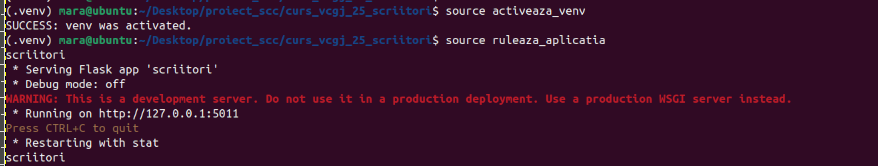
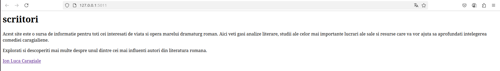

# curs_vcgj_25_scriitori

`scriitori`
===================================

# Cuprins

1. [Descriere aplicatie](#descriere-aplicatie)
1. [Descriere versiune](#descriere-versiune)
1. [Configurare](#configurare)
1. [Exemple pagina web](#exemple-pagina-web)
1. [Testare cu pytest](#testare-cu-pytest)
1. [Verificare statica. pylint - calitate cod](#verificare-statica-cu-pylint)
1. [Utilizare Docker si containerizare alicatie](https://github.com/crchende/sysinfo/blob/main/doc/dockerdoc.md)
1. [DevOps](#devops-ci)
   1. [Pipeline Jenkins](#exemplu-executie-pipeline-jenkins)
   1. [Workflow GitHub Actions](#exemplu-executie-workflow-in-github-actions)
1. [Bibliografie](#bibliografie)

# Descriere aplicatie

Aplicația scriitori este o aplicație web educațională care oferă informații despre viața și opera scriitorului Ion Luca Caragiale. Scopul aplicației este de a facilita accesul la date esențiale despre autor și creațiile sale literare într-un mod structurat și accesibil din browser. Partea web a aplicației este construită folosind framework-ul Flask. Codul aplicației este scris în Python și folosește structuri simple pentru a încărca și afișa conținutul informativ, organizat în pagini tematice (operă reprezentativa, curente literare etc.).

Navigarea este intuitivă: pagina principală include link-uri către celelalte secțiuni ale aplicației, iar fiecare pagină tematică include un link de întoarcere la pagina principala.

Aplicatia include suport pentru containerizare in fisierul `Dockerfile` din directorul principal al aplicatiei.

Din punct de vedere al testarii, este inculs unit testing cu pytest, pentru o parte din functiile din biblioteca aplicatiei, aflate in directorul `app/libs`.

`DevOps CI`.
Pipeline-ul pentru Jenkins este definint in fisierul `Jenkinsfile`.

Pipeline-uri cloneaza codul, creaza mediul de lucru virtual (venv-ul), il activeaza si ruleaza testele (unit test - cu pytest, verificari statice cu pylint).

# Descriere versiune
## v0.1 – afisare informatii de baza despre Ion Luca Caragiale. Structura initiala a aplicatiei cu pagina principala si link-uri catre pagini tematice.

 * ruta standard '/' - URL: http://127.0.0.1:5011
 * rute in aplicatia WEB pentru:
   * scriitor: '/Ion_Luca_Caragiale' - URL: 'http://127.0.0.1:5011/Ion_Luca_Caragiale',
   * opera reprezentativa:      '/Opera_reprezentativa'      - URL: 'http://127.0.0.1:5011/Opera_reprezentativa'
   * curent literar: '/Curent_literar' - URL: 'http://127.0.0.1:5011/Curent_literar'


# Configurare
[cuprins](#cuprins)

Clonare repository

Creati spatiul de lucru si clonati aplicatia sysinfo: 

```text   
   mkdir proiect_scc
   cd proiect_scc
   git clone https://github.com/daeryn19/curs_vcgj_25_scriitori.git (aduc repository-ul scriitori de pe git in calculatorul local)

   
```

Configurare .venv

In directorul 'curs_vcgj_25_scriitori' rulati comenzile:

1) activeaza_venv: Incearca sa activeze venv-ul. 
                   Daca nu poate, configureaza venv-ul in directorul .venv si apoi instaleaza flask si flask-bootstrap.
                   La urmatoarea rulare, va activa doar venv-ul.
                
2) ruleaza_aplicatia: De rulat doar dupa activarea venv-ului. 
                      Va porni serverul pe IP: 127.0.0.1 si port: 5011.
                      Acces server din browser: http://127.0.0.1:5011

# EXEMPLU activare venv si rulare
```text
    (.venv) mara@ubuntu:~/Desktop/proiect_scc/curs_vcgj_25_scriitori$ source activeaza_venv
SUCCESS: venv was activated.
(.venv) mara@ubuntu:~/Desktop/proiect_scc/curs_vcgj_25_scriitori$ source ruleaza_aplicatia
scriitori
 * Serving Flask app 'scriitori'
 * Debug mode: off
WARNING: This is a development server. Do not use it in a production deployment. Use a production WSGI server instead.
 * Running on http://127.0.0.1:5011
Press CTRL+C to quit
 * Restarting with stat
scriitori

```




# EXEMPLE pagina web 
## Pagina principala




# Testare cu pytest
[cuprins](#cuprins)

O parte din functiile din biblioteca de functii a aplicatie:
- directorul lib, fisierele:
  - ubuntu.py
  - network.py
au teste de tip 'unit - test' asociate - adica - este apelata functia si se asteapta o anumita valoare.
Testul compara valoarea obtinuta la apelul functie cu valoarea asteptata si returneaza PASS daca valoarea primita de la functie este cea asteptata si FAIL in caz contrar.

Pentru testare s-a folosit pachetul **pytest** din python. Acesta se afla in lista de pachete care trebuie instalate, in fisierul quickrequirements.txt.


# Verificare statica cu pylint
[cuprins](#cuprins)

- **pylint** - pachet python folosit la testarea calitatii codului (spatii, nume variabile, variabile neutilizate etc.)
- in cazul de fata, problemele returnate de pylint doar sunt afisate, nu sunt considerate erori


# Reprezentari grafice
[cuprins](#cuprins)
* Pachetul matplotlib pune la dispozitie o metoda de a face reprezentari grafice
* O aplicatie concretea pentru informatii de sistem, pot fi grafice cu utilizarea memoriei, a procesorului, retelei etc.
* Pentru simplitate aplicatia curenta genereaza valorile si afiseaza graficul unei functii de grad 2: **y = x*x**
    * valorile sunt discrete, x in {-10, -9, ... 9, 10}
    * matplotlib poate desena punctele sau un grafic continuu pe baza acestor puncte


## Exemplu pagina web cu grafice

* sunt mai multe grafice in pagina, captura cuprinde doar doua reprezentari cu puncte, cu culori si caractere diferite:


# DevOps CI
[cuprins](#cuprins)
- CI = Continuous Integration

## Exemplu executie pipeline Jenkins


## Exemplu executie Workflow in GitHub Actions


Aplicatia poate fi accesata si de pe AZURE

URL: https://sysinfov3.azurewebsites.net


# Bibliografie:
[cuprins](#cuprins)
- [Github Actions](https://docs.github.com/en/actions)
