# curs_vcgj_25_scriitori

`443D + 445D`
=======================================

# CUPRINS

1. [ABAGIU ANDREEA](#abagiu-andreea)
2. [ARON RAZVAN](#aron-razvan)
3. [BASTON IONELA](#baston-ionela)
4. [BRUMA ANDREI](#bruma-andrei)
5. [BURLACU ANDREEA](#burlacu-andreea)
6. [CAZANARU RADU](#cazanaru-radu)
7. [COFARU STEFAN](#cofaru-stefan)
8. [DUMITRU MARIA](#dumitru-maria)
9. [GHIMUS DARIA](#ghimus-daria)
10. [GRANCEA DANA](#grancea-dana)
11. [GURAMBA ELENA](#guramba-elena)
12. [HANGIU ANA](#hangiu-ana)
13. [IONESCU MIHAI](#ionescu-mihai)
14. [MARE VLAD](#mare-vlad)
15. [MARIN CRISTIAN](#marin-cristian)
16. [MARINESCU ANDREI](#marinescu-andrei)
17. [MATEI ANDRA](#matei-andra)
18. [MAZILESCU MIHAI](#mazilescu-mihai)
19. [MIHAILA ADELIN](#mihaila-adelin)
20. [PATRASCU GEORGE](#patrascu-george)
21. [PAUN FLORIN](#paun-florin)
22. [POPA ADRIAN](#popa-adrian)
23. [POPESCU VLAD](#popescu-vlad)
24. [RISTOIU FLORIN](#ristoiu-florin)
25. [ROTARU MARA](#rotaru-mara)
26. [SMARANDACHE MIHNEA](#smarandache-mihnea)
27. [VEGA TUDOR](#vega-tudor)

# ABAGIU ANDREEA
[cuprins](#cuprins)

# Proiect SCC 2025 – Tudor Arghezi

## 🔹 Informații generale
- Nume student: Andreea Abagiu
- PID: 8
- Tema aleasă: Scriitori – Tudor Arghezi
- Branch principal: `main_abagiu_andreea`
- Branch dezvoltare: `devel_abagiu_andreea`

---

## ✅ Funcționalitate implementată
- Aplicație Flask cu 4 rute:
  - `/` – pagina principală
  - `/biografie` – descriere scriitor
  - `/opere` – listă opere
  - `/citat` – citat reprezentativ
- Funcțiile sunt în `app/lib/helper.py`

---

## ✅ Testare
- Fișiere de test în `app/tests/`
- Rulate cu `pytest`, testele verifică:
  - status 200 pentru fiecare rută
  - prezența unor cuvinte-cheie în răspuns
- Testele trec complet (`4 passed`)

---

## ✅ Calitate cod – pylint
- Verificări automate din Jenkins pe:
  - `t_arghezi.py`
  - `app/lib/helper.py`
  - `app/tests/test_t_arghezi.py`

---

## ✅ Docker
- Aplicația rulează într-un container
- `Dockerfile` prezent și testat
- Imaginea se construiește și rulează cu:
  ```bash
  docker build -t arghezi_app .
  docker run -p 5050:5000 arghezi_app

# ARON RAZVAN
[cuprins](#cuprins)

# BASTON IONELA
[cuprins](#cuprins)

# Proiect SCC - Ionela Baston

## Scriitor ales: **Liviu Rebreanu**

# LiviuRebreanu
============================

## Cuprins
1. [Descriere aplicație](#descriere-aplicație)
2. [Versiune și status](#versiune-și-status)
  1. [Probleme cunoscute](#probleme-cunoscute)
3. [Configurare și rulare](#configurare-și-rulare)
4. [Containerizare](#containerizare)
5. [Stadiu dezvoltare branch](#stadiu-dezvoltare-branch)
6. [Bibliografie](#bibliografie)

---

## Descriere aplicație

**LiviuRebreanu** este o aplicație web creată în Python, care folosește framework-ul Flask pentru a oferi informații despre scriitorul Liviu Rebreanu.

Proiectul a fost realizat pentru a învăța concepte de bază de lucru cu rute Flask și containerizare Docker. Structura este simplă și permite afișarea a două atribute esențiale: viața și opera scriitorului.

Fișierul principal este `scriitori_baston.py` iar logica este separată într-un modul auxiliar pentru claritate și modularitate.

---
### Interfața aplicației

## Interfață - Pagina Rebreanu


---

## Versiune și status
**v1.0 – versiune funcțională finalizată**
- Flask funcțional local
- Docker funcțional
- README complet
- Pull Request realizat

### Probleme cunoscute
- Fără interfață grafică HTML
- Nu este inclus un sistem de testare automată

---

## Configurare și rulare

### 1. Activare mediu virtual și instalare Flask

```bash
python3 -m venv venv
source venv/bin/activate
pip install flask
```

### 2. Rulare aplicație local

```bash
python3 app/scriitori_baston.py
```

Aplicația va fi disponibilă la adresa:
 `http://127.0.0.1:5000/rebreanu`

---

## Containerizare

### Dockerfile utilizat:

```dockerfile
FROM python:3.10-slim
WORKDIR /app
COPY . .
RUN pip install flask
CMD ["python3", "app/scriitori_baston.py"]
```

### Comenzi utile

```bash
sudo docker build -t rebreanu-app .
sudo docker run -p 5000:5000 rebreanu-app
```

Aplicația va fi accesibilă la `http://localhost:5000/rebreanu`

---

## Stadiu dezvoltare branch

### Funcționalitate implementată:
- Afișare rută `/rebreanu` + 2 subruturi `/rebreanu/viata` și `/rebreanu/opera`
- Separare logică în modul biblioteca_scriitori.py
- Containerizare Docker

### Stadiul actual:
 Complet funcțional și testat local

### Integrare:
- Pull Request deschis din `devel_baston_ionela` spre `main`

---

## Bibliografie

- https://flask.palletsprojects.com/
- https://docs.docker.com/

# BRUMA ANDREI
[cuprins](#cuprins)

# BURLACU ANDREEA
[cuprins](#cuprins)
# curs_vcgj_25_scriitori

Aplicație educațională despre scriitori străini – Victor Hugo.

---

## Cuprins

1. [Descriere aplicație](#descriere-aplicație)  
2. [Versiune](#versiune)  
3. [Configurare](#configurare)
4. [Functionalitati](#functionalitati)
5. [Exemple pagină web](#exemple-pagină-web)  
6. [Testare cu pytest](#testare-cu-pytest)  
7. [Utilizare Docker și containerizare aplicație](#docker)  
8. [DevOps CI - Jenkins](#devops-ci)  
9. [Bibliografie](#bibliografie)  

---

## Descriere aplicație

Aplicația **Scriitori** este o aplicație web simplă, realizată cu Flask, care oferă informații despre viața și opera scriitorului **Victor Hugo**.

- Pagina principală afișează un meniu cu scriitorul.
- Fiecare scriitor are pagini dedicate pentru:
  - opere reprezentative
  - descriere scriitor

Aplicația este testată cu `pytest`, containerizată cu Docker și automatizată cu Jenkins CI.

---

## Versiune

**v0.1** – Funcționalitate minimă:  
- pagini pentru scriitor, operă și curent literar  
- testare automată  
- fișiere pentru CI și containerizare  

---

## Configurare

### Clonare repository

```bash
git clone -b devel_nume_tău https://github.com/nume-user/curs_vcgj_25_scriitori.git
cd curs_vcgj_25_scriitori

### Configurare mediu virtual

```bash
python3 -m venv venv
source venv/bin/activate
pip install -r requirements.txt
```

### Rulare aplicație

```bash
export FLASK_APP=app/443D_scriitori.py
flask run
```


Accesează în browser:  
[http://127.0.0.1:5000](http://127.0.0.1:5000)


---

## Functionalitati


## Exemple pagină web

### Pagina principală  


### Pagina scriitorului Victor Hugo  


### Descriere scriitor  


### Opere reprezentative  


---

## Testare cu pytest

Rulare teste:

```bash
pytest
```


---


## Docker

### Creare imagine, container si rulare:

```bash
sudo docker build -t scriitori_victor_hugo .
```


### Imagini existente:

```bash
docker images
```


### Containere existente:

```bash
sudo docker ps -a
```


### Oprire container:

```bash
sudo docker stop epic_hawking
```
### Stergere imagine si container:

```bash
sudo docker rmi scriitori_victor_hugo
sudo docker rm epic_hawking
```


---

## DevOps CI

### Pipeline Jenkins
- Fișierul `Jenkinsfile` conține pașii pentru testare și build.
- Este configurat cu un pipeline declarativ.

```bash
pipeline {
    agent any

    stages {

        stage('Instalare dependințe') {
            steps {
                echo 'Se instaleaza dependintele...'
                sh '''
                    python3 -m venv venv
                    . venv/bin/activate
                    pip install --upgrade pip
                    pip install -r requirements.txt
                '''
            }
        }

        stage('Testare') {
            steps {
                echo 'Se rulează testele...'
                sh '''
                    . venv/bin/activate
                    pytest
                '''
            }
        }
    }

    post {
        success {
            echo 'Build finalizat cu succes!'
        }
        failure {
            echo 'Build eșuat!'
        }
    }
}
```


```
Pull Request


## Bibliografie

- [Python](https://docs.python.org/)
- [Flask](https://flask.palletsprojects.com/)
- [Pytest](https://docs.pytest.org/)
- [Docker](https://www.docker.com/)
- [Jenkins](https://www.jenkins.io/)
- [Proiect SCC GitHub (exemplu)](https://github.com/crchende/sysinfo)

# CAZANARU RADU
[cuprins](#cuprins)

# COFARU STEFAN
[cuprins](#cuprins)

# DUMITRU MARIA
[cuprins](#cuprins)

`scriitori`
===================================
# Cuprins

1. [Descriere aplicatie](#descriere-aplicatie)
1. [Descriere versiune](#descriere-versiune)
1. [Configurare](#configurare)
1. [Exemple pagina web](#exemple-pagina-web)
1. [Testare cu pytest](#testare-cu-pytest)
1. [Verificare statica. pylint - calitate cod](#verificare-statica-cu-pylint)
1. [Docker](#docker)
   1. [Creare container](#creare-container)
   1. [Executie container](#executie-container)
   1. [Vizualizare containere](#vizualizare-containere)
   1. [Oprire / pornire container - cu aplicatia din container](#oprire-pornire-container-cu-aplicatia-din-containere)
   1. [Curatenie - stergere containere / imagini](#curatenie-stergere-containere-cu-aplicatia-din-containere)
   1. [Lista de comenzi docker utile:](#lista-comenzi-docker-utile)
1. [DevOps](#devops-ci)
   1. [Pipeline Jenkins](#exemplu-executie-pipeline-jenkins)
1. [Bibliografie](#bibliografie)

# Descriere aplicatie

Aplicația realizată are ca temă principală scriitorii și face parte din proiectul VCGJ, desfășurat în cadrul cursului „Servicii Cloud și Containerizare”.
Aceasta este realizată folosind framework-ul Flask, în Python, și conține funcționalități specifice scriitoareilui Ruta Sepetys.
Funcționalitatea implementată include afișarea informațiilor despre:
Opera "Sârșitul șoaptelor"
Curentul literar – Ficțiune istorică

Pentru o navigare mai usoara in browser, pagina principala contine link-uri catre celelalte pagini. Fiecare pagina specifica contine un link către celelalte pagini.

Aplicația oferă suport pentru containerizare prin intermediul fișierului Dockerfile aflat în directorul principal al proiectului.

Din punct de vedere al testarii, este inculs unit testing cu pytest, pentru o parte din functiile din biblioteca aplicatiei, aflate in directorul app/libs.

DevOps CI. Pipeline-ul pentru Jenkins este definint in fisierul Jenkinsfile. 

Ambele pipeline-uri cloneaza codul, creaza mediul de lucru virtual (venv-ul), il activeaza si ruleaza testele (unit test - cu pytest, verificari statice cu pylint).
# Descriere versiune
## v0.1 – Funcționalitate de bază implementată

* ruta standard '/' - URL: http://127.0.0.1:5011
 * rute in aplicatia WEB pentru:
   * scriitor: '/Ruta_Sepetys' - URL: 'http://127.0.0.1:5011/Ruta_Sepetys',
   * opera reprezentativa: '/opera_reprezentativa' - 'http://127.0.0.1:5011/Ruta_Sepetys/opera_reprezentativa'
   * curent literar:       '/curent_literar'       - 'http://127.0.0.1:5011/Ruta_Sepetys/curent_literar'

# Configurare
[cuprins](#cuprins)

Configurare .venv si instalare pachete

In directorul 'app' rulati comenzile:
1) activeaza_venv: Incearca sa activeze venv-ul. 
                   Daca nu poate, configureaza venv-ul in directorul .venv si apoi instaleaza flask si flask-bootstrap.
                   La urmatoarea rulare, va activa doar venv-ul.

2) ruleaza_aplicatia: De rulat doar dupa activarea venv-ului. 
                      Va porni serverul pe IP: 127.0.0.1 si port: 5011.
                      Acces server din browser: http://127.0.0.1:5011
# EXEMPLU activare venv si rulare
```text
    hangiu-ana@hangiu-ana:scriitori$ source activeaza_venv 
    SUCCESS: venv was activated.

   (.venv) hangiu-ana@hangiu-ana:scriitori$ source ruleaza_aplicatia 
    scriitori
    WARNING: rand 6 []
     * Serving Flask app 'scriitori'
     * Debug mode: off
    WARNING: This is a development server. Do not use it in a production deployment. Use a production WSGI server instead.
     * Running on http://127.0.0.1:5011
    Press CTRL+C to quit
     * Restarting with stat
    scriitori
```

# Exemplu Pagina Principala
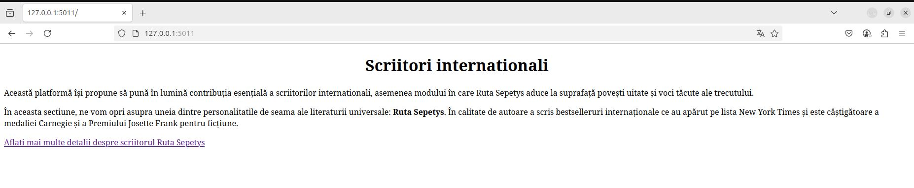

#Exemplu Pagina Ruta Sepetys
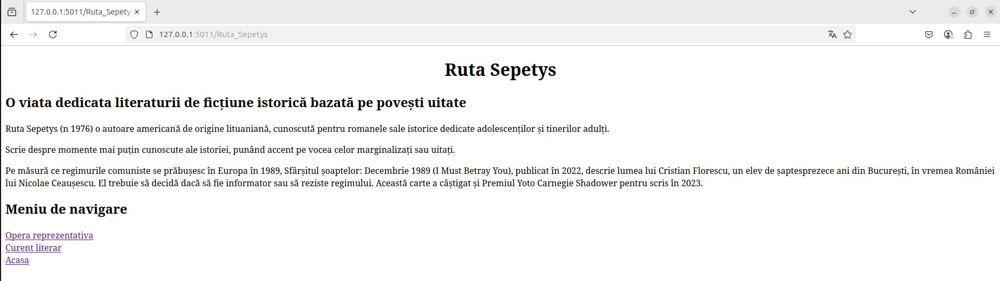

# Exemplu Pagina Opera Reprezentativa
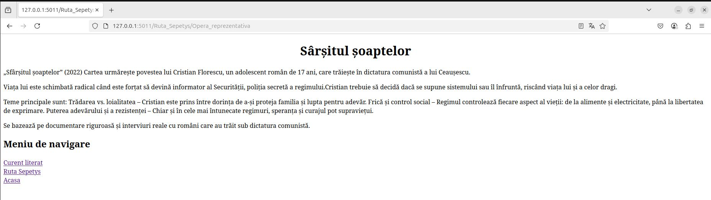

#Exemplu Pagina Curent Literar 
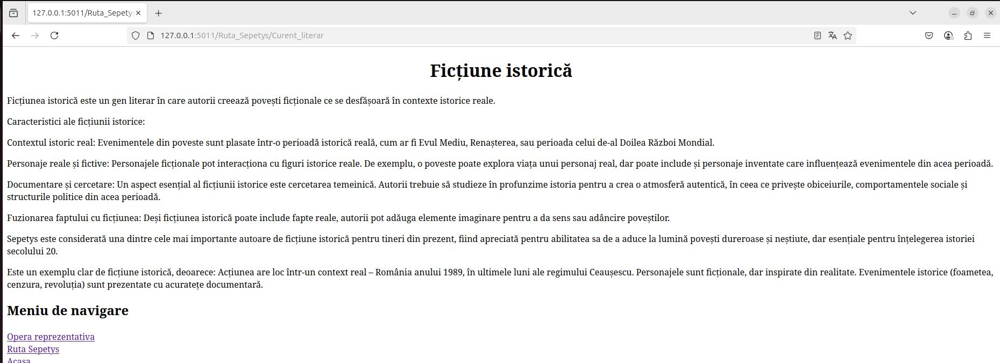


# Testare cu pytest
[cuprins](#cuprins)

O parte dintre funcțiile din biblioteca aplicației, aflată în directorul libs (fișierul feature.py), au teste de tip unit-test asociate. Aceste teste presupun apelarea funcției respective și compararea valorii returnate cu valoarea așteptată. Testul va returna PASS dacă valoarea obținută este corectă și FAIL în caz contrar.

Pentru testare, s-a utilizat pachetul pytest din Python, care este inclus în lista de pachete necesare în fișierul requirements.txt. Executarea testelor poate fi realizată folosind oricare dintre comenzile de mai jos, apelate din directorul aplicației scriitori:
```
   pytest
   python -m pytest
   flask --app scriitori test

   Ultima comandă devine posibilă datorită implementării comenzii CLI test în aplicația sysinfo. Această comandă CLI execută    pytest din programul/script utilizând:
       pytest.main(["."])
   
   Deși echivalentă cu primele două opțiuni, această variantă este considerată mai elegantă. În primele două cazuri, pytest    este tratat ca un tool extern aplicației, în timp ce în acest caz opțiunea de autotestare este integrată direct în    aplicație.

   (.venv) hangiu-ana@hangiu-ana-VirtualBox:~/Desktop/proiect_giulia/curs_vcgj_25_scriitori$ pytest
============================================================================ test session starts =============================================================================
platform linux -- Python 3.12.3, pytest-8.3.5, pluggy-1.5.0
rootdir: /home/hangiu-ana/Desktop/proiect_giulia/curs_vcgj_25_scriitori
configfile: pytest.ini
collected 2 items                                                                                                                                                            

app/test/test_lib.py::test_opera_reprezentativa PASSED                                                                                                                 [ 50%]
app/test/test_lib.py::test_curent_literar PASSED                                                                                                                       [100%]

============================================================================= 2 passed in 0.06s ==============================================================================


```
# Verificare statica cu pylint
[cuprins](#cuprins)

- **pylint** - pachet python folosit la testarea calitatii codului (spatii, nume variabile, variabile neutilizate etc.)
- in cazul de fata, problemele returnate de pylint doar sunt afisate, nu sunt considerate erori
```
   pylint scriitory.py
   (.venv) hangiu-ana@hangiu-ana-VirtualBox:~/Desktop/proiect_giulia/curs_vcgj_25_scriitori$ pylint scriitori.py
************* Module scriitori
scriitori.py:13:0: C0301: Line too long (223/100) (line-too-long)
scriitori.py:14:0: C0301: Line too long (331/100) (line-too-long)
scriitori.py:15:0: C0301: Line too long (103/100) (line-too-long)
scriitori.py:22:0: C0301: Line too long (170/100) (line-too-long)
scriitori.py:23:0: C0301: Line too long (129/100) (line-too-long)
scriitori.py:24:0: C0301: Line too long (434/100) (line-too-long)
scriitori.py:34:0: C0301: Line too long (183/100) (line-too-long)
scriitori.py:35:0: C0301: Line too long (240/100) (line-too-long)
scriitori.py:36:0: C0301: Line too long (405/100) (line-too-long)
scriitori.py:37:0: C0301: Line too long (124/100) (line-too-long)
scriitori.py:47:0: C0301: Line too long (146/100) (line-too-long)
scriitori.py:49:0: C0301: Line too long (196/100) (line-too-long)
scriitori.py:50:0: C0301: Line too long (266/100) (line-too-long)
scriitori.py:51:0: C0301: Line too long (300/100) (line-too-long)
scriitori.py:52:0: C0301: Line too long (185/100) (line-too-long)
scriitori.py:53:0: C0301: Line too long (276/100) (line-too-long)
scriitori.py:54:0: C0301: Line too long (328/100) (line-too-long)
scriitori.py:1:0: C0114: Missing module docstring (missing-module-docstring)
scriitori.py:11:0: C0116: Missing function or method docstring (missing-function-docstring)
scriitori.py:19:0: C0116: Missing function or method docstring (missing-function-docstring)
scriitori.py:32:0: C0116: Missing function or method docstring (missing-function-docstring)
scriitori.py:45:0: C0116: Missing function or method docstring (missing-function-docstring)
scriitori.py:66:4: C0415: Import outside toplevel (pytest) (import-outside-toplevel)

------------------------------------------------------------------
Your code has been rated at 5.49/10 (previous run: 5.62/10, -0.13)


```


# Docker
[cuprins](#cuprins)

##Creare container

Dupa crearea Dockerfile, in acelasi director cu acest fisier - pentru acest caz
scriitori, trebuie executata comanda:
 sudo docker build -t scriitori:v02 .

Aceasta creeaza o imagine de container care poate fi vizualizata cu comanda:
 
    (.venv) hangiu-ana@hangiu-ana-VirtualBox:~/Desktop/proiect_giulia/curs_vcgj_25_scriitori$ docker images
REPOSITORY   TAG           IMAGE ID       CREATED             SIZE
scriitori    v02           64ae0e13b54e   5 seconds ago       79.7MB
python       3.8-alpine    cd39247b02f9   8 months ago        47.4MB

    Avem doua imagini:
    - imaginea de baza, python:3.8-alpine, folosita pentru a
      crea imaginea scriitori:v01
    - imaginea scriitori, creata pe baza imaginii python, in care se
      creaza venv-ul, se instaleaza pachetele necesare aplicatiei, se copiaza
[cuprins](#cuprins)      codul aplicatiei - conform Dockerfile
##Executie container

Pentru a genera un container din fisierul imagine trebuie executata comanda run:

    sudo docker run --name scriitori02 -p 8020:5011 scriitori:v02 

    Aceasta va crea containerul si va si porni executia acestuia.

    Portul pe calculator unde va raspunde serverul din docker este  - 8020
    Portul in interiorul containerului este                         - 5011.

    Rezultatul executie containerului va fi vizibil in terminalul de unde s-a dat
    comanda.
    In consola apar mesajele generate de aplicatia din container.

    -d - optiune care trebuie adaugata pentru a rula containerul in background
         altfel, consola din care ruleaza containerul este blocata pe timpul
         rularii acestuia
 
    NOTA:
    --nume <nume>  este de folosit aceasta optiune.
                   altfel docker va crea un string aleator si-l va aloca ca nume
                   container-ului pornit

##Vizualizare containere

    - vizualizare continere care ruleaza


    sudo docker ps

    CONTAINER ID   IMAGE                            COMMAND              CREATED          STATUS          PORTS                                       NAMES
    0e9388ac0d7d   scriitori:v02                  "./dockerstart.sh"    50 minutes ago      Up 22 minutes   0.0.0.0:8020->5011/tcp, :::8020->5011/tcp   scriitori

    - vizualizarea tuturor containerelor (inclusiv cele oprite)

(.venv) hangiu-ana@hangiu-ana-VirtualBox:~/Desktop/proiect_giulia/curs_vcgj_25_scriitori$ sudo docker ps -a
CONTAINER ID   IMAGE           COMMAND              CREATED             STATUS                         PORTS                                       NAMES
e2d99b6b747b   scriitori:v02   "./dockerstart.sh"   53 seconds ago      Exited (0) 11 seconds ago                                                  scriitori02
2a6dbcb7b457   c32c582780ca    "./dockerstart.sh"   4 minutes ago       Created                        0.0.0.0:8020->5011/tcp, :::8020->5011/tcp   scriitori2
8f248ce140d5   dc91b8585c20    "./dockerstart.sh"   About an hour ago   Exited (0) About an hour ago                                               scriitori
a7fac9aedb2b   sysinfo:v01     "./dockerstart.sh"   7 weeks ago         Exited (0) 7 weeks ago                                                     sysinfo

##Oprire / pornire container - cu aplicatia din container

    sudo docker stop scriitori
    sudo docker start scriitori

##Curatenie - stergere containere / imagini


    sudo docker rm  <container (id, nume)r>
    sudo docker rmi <imagine (id, nume:tag ...)>

##Lista de comenzi docker utile:

        Creare container:            sudo docker build -t <nume>:<tag>
        Vizualizare imagini:         sudo docker images
        Vizualizare containere:      sudo docker ps / sudo docker ps -a
        Rulare container:            sudo docker run -name <nume> -p <port PC>:<port Container> <imagine> [-d] # -d pentru a rula in background
        Stop container:              sudo docker stop
        Start container:             sudo docker start
        Executie shell:              sudo docker exec -it <nume> sh
        Atasare la container:        sudo docker atach <nume>


# DevOps CI
[cuprins](#cuprins)
- CI = Continuous Integration

## Exemplu executie pipeline Jenkins
Pentru a putea executa ultimul pas din pipeline-ul Jenkins (crearea containerului Docker) din acest branch, utilizatorul care rulează Jenkins trebuie să aibă permisiunea de a rula comenzi Docker fără a utiliza sudo sau a introduce parola.

Pașii de configurare pot fi găsiți pe docs.docker.com - linux-postinstall.

Dacă utilizați o mașină virtuală Linux, asigurați-vă că reporniți mașina după ce finalizați configurarea.
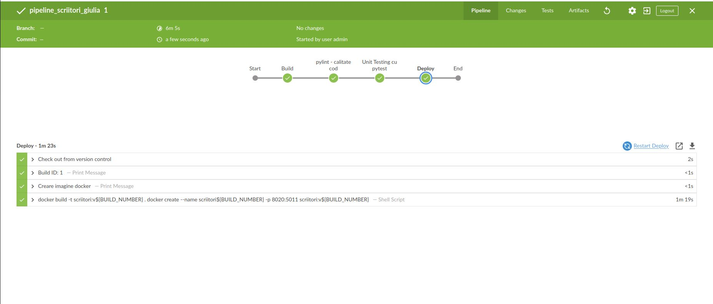


# Bibliografie:
[cuprins](#cuprins)
- [Github Sysinfo](https://github.com/crchende/sysinfo/tree/simplu_main)


# GHIMUS DARIA
[cuprins](#cuprins)

# curs_vcgj_25_scriitori
# Scriitori – Proiect Flask cu CI/CD

**Autor:** Ghimus Daria Florina  
**Grupa:** 443D  
**Curs:** Servicii Cloud și Containerizare (CI/CD)  
**Profesor:** Badoi Cornelia Ionela  
**An:** 2025 

---

## Cuprins

1. [Descriere aplicație](#descriere-aplicație)  
2. [Versiune](#versiune)  
3. [Structură proiect](#structură-proiect)  
4. [Configurare locală](#configurare-locală)  
5. [Rulare aplicație](#rulare-aplicație)  
6. [Testare cu Pytest](#testare-cu-pytest)  
7. [Verificare statică cu Pylint](#verificare-statică-cu-pylint)  
8. [Docker](#docker)  
9. [Pipeline Jenkins (CI/CD)](#pipeline-jenkins-cicd)  
10. [Bibliografie](#bibliografie)

---

## Descriere aplicație

Această aplicație web este realizată în Flask și are ca scop afișarea informațiilor despre scriitoarea Rodica-Ojog-Brasoveanu. Este parte dintr-un proiect educațional pentru cursul de DevOps și containerizare.

Funcționalități implementate:
- Afișarea scriitorului: **Rodica Ojog-Brașoveanu**
- Opera reprezentativă: *Secretul celor trei*
- Curent literar: **Thriller și Suspans**

Navigarea în aplicație se face prin link-uri între paginile principale, facilitând o experiență web simplă și clară.

Aplicația este pregătită pentru rulare locală, în Docker, și în pipeline-ul Jenkins (CI/CD).

---

## Versiune

**v0.1 – Funcționalitate de bază:**

- Pagina principală: `http://127.0.0.1:5000`
- Rute disponibile:
  - `/Rodica_Ojog_Brasoveanu`
  - `/Rodica_Ojog_Brasoveanu/Opera_Reprezentativa`
  - `/Rodica_Ojog_Brasoveanu/Curent_Literar`

---

## Structură proiect


```
curs_vcgj_25_scriitori/
├── app/
│   └── tests/
│       └── test_atribute.py
├── scriitori.py
├── requirements.txt
├── Dockerfile
├── Jenkinsfile
├── activeaza_venv
├── activeaza_venv_jenkins
├── ruleaza_aplicatia
├── dockerstart.sh
├── pytest.ini
```

- `scriitori.py` – fișierul principal al aplicației Flask; definește rutele și logica afișării.
- `app/tests/` – conține testele unitare scrise cu `pytest`, care verifică funcțiile aplicației.
- `Jenkinsfile` – definește pașii pipeline-ului CI/CD (build, testare, deploy).
- `Dockerfile` – conține instrucțiunile pentru containerizarea aplicației într-o imagine Docker.
- `activeaza_venv` și `activeaza_venv_jenkins` – scripturi pentru activarea mediului virtual Python (venv).
- `ruleaza_aplicatia` – script de pornire a serverului Flask.
- `dockerstart.sh` – script folosit la pornirea aplicației din interiorul unui container Docker.

## Configurare locală

Pentru a rula aplicația local, este necesar să creezi un mediu virtual Python și să instalezi pachetele din `requirements.txt`.

### 1. Creare și activare mediu virtual

Folosim scriptul `activeaza_venv`, care:

- Verifică dacă `.venv` există;
- Dacă nu există, îl creează automat;
- Instalează Flask și celelalte biblioteci;
- Activează mediul virtual.

Comandă:

```bash
source activeaza_venv
```

După rulare, vei vedea mesajul `SUCCESS: venv was activated`, ceea ce înseamnă că mediul este activ și poți continua.

### 2. Instalare pachete (dacă venv e deja activ)

Dacă mediul `.venv` este deja activ, poți instala pachetele folosind:

```bash
pip install -r requirements.txt
```

Acest fișier conține toate dependințele necesare: Flask, Pytest, Pylint etc.

---

## Rulare aplicație

```bash
source ruleaza_aplicatia
```

După rulare, în terminal ar trebui să apară un mesaj:

 * Running on http://127.0.0.1:5000

Acesta indică faptul că serverul Flask rulează pe IP-ul local (localhost) și portul 5000.

Mai jos se regasesc capturi cu fiecare pagină a aplicației:

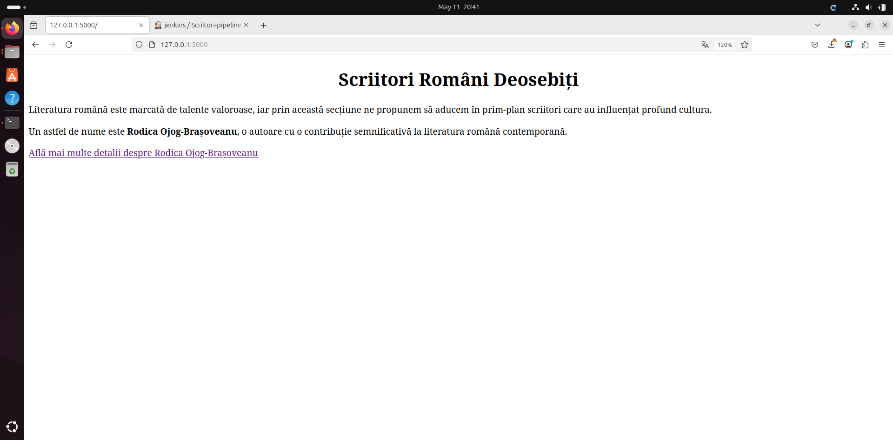


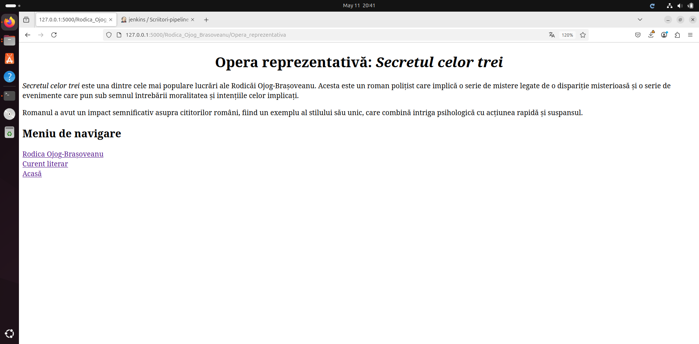

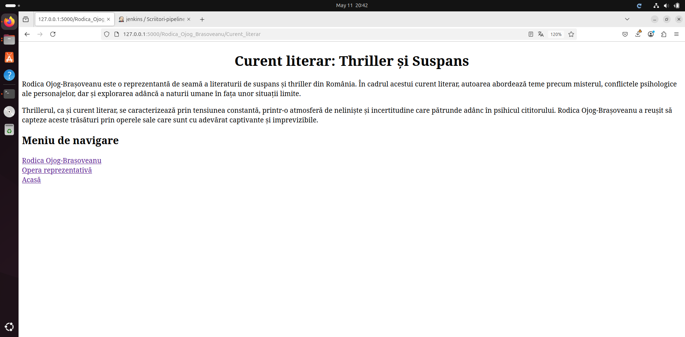

---

## Testare cu Pytest

Testele verifică funcții asociate scriitorului și operei sale.

Comenzi disponibile:

```bash
pytest
```

---

## Verificare statică cu Pylint

```bash
pylint scriitori.py
```

Scop: identificarea stilurilor greșite, spațiere incorectă, importuri neutilizate, lipsă docstring etc.

---

## Docker

```bash
# Construire imagine
sudo docker build -t scriitori:v01 .

# Rulare container
sudo docker run --name scriitori -p 8020:5000 scriitori:v01

# Oprire / pornire
sudo docker stop scriitori
sudo docker start scriitori

# Curățare
sudo docker rm scriitori
sudo docker rmi scriitori:v01
```

Aplicația va fi accesibilă la `http://localhost:8020` în afara containerului.

---

## Pipeline Jenkins (CI/CD)

Pipeline-ul este descris în `Jenkinsfile` și conține următoarele etape:

1. **Checkout SCM** – clonare cod  
2. **Build** – activare venv + instalare pachete  
3. **Pylint** – analiză statică cod  
4. **Pytest** – rulare teste unitare  
5. **Deploy** – construire imagine Docker  

>  Pentru ca Jenkins să poată construi imaginea Docker, utilizatorul `jenkins` trebuie să aibă acces la Docker fără `sudo`.

Comandă pentru a-l adăuga în grupul docker:

```bash
sudo usermod -aG docker jenkins
```

### Exemplu vizualizare în Blue Ocean

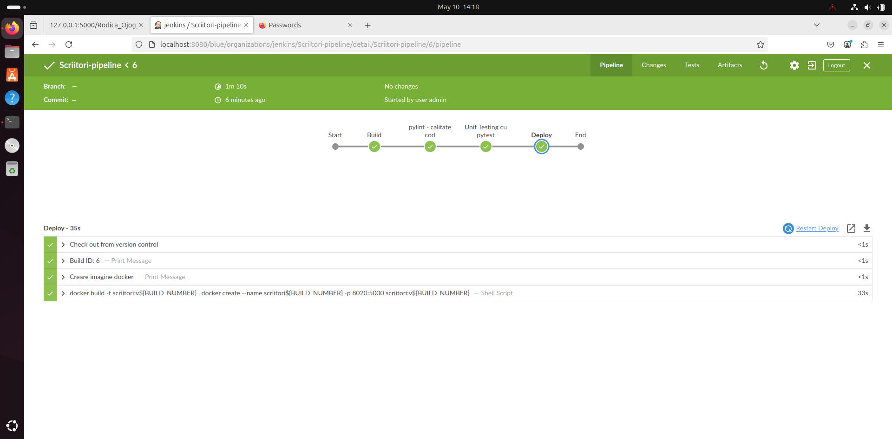

---

## Bibliografie

- https://github.com/crchende/sysinfo – sursa principală de inspirație pentru structură și configurare
- https://github.com/daeryn19/curs_vcgj_25_scriitori – repository-ul proiectului personal
- https://flask.palletsprojects.com/ – documentație oficială Flask

# GRANCEA DANA
[cuprins](#cuprins)

# curs_vcgj_25_scriitori

`scriitori`
===================================
# Cuprins

1. [Descriere aplicatie](#descriere-aplicatie)
1. [Descriere versiune](#descriere-versiune)
1. [Configurare](#configurare)
1. [Exemple pagina web](#exemple-pagina-web)
1. [Testare cu pytest](#testare-cu-pytest)
1. [Verificare statica. pylint - calitate cod](#verificare-statica-cu-pylint)
1. [Docker](#docker)
   1. [Creare container](#creare-container)
   1. [Executie container](#executie-container)
   1. [Vizualizare containere](#vizualizare-containere)
   1. [Oprire / pornire container - cu aplicatia din container](#oprire-pornire-container-cu-aplicatia-din-containere)
   1. [Curatenie - stergere containere / imagini](#curatenie-stergere-containere-cu-aplicatia-din-containere)
   1. [Lista de comenzi docker utile:](#lista-comenzi-docker-utile)
1. [DevOps](#devops-ci)
   1. [Pipeline Jenkins](#exemplu-executie-pipeline-jenkins)
1. [Bibliografie](#bibliografie)

# Descriere aplicatie

Aplicația dezvoltată are ca temă scriitori și este parte din proiectul VCGJ din cadrul cursului Servicii Cloud și Containerizare. 
Aceasta este realizată folosind framework-ul Flask, în Python, și conține funcționalitate specifică scriitorului Ioan Slavici.
Funcționalitatea implementată include afișarea informațiilor despre:
Opera reprezentativă – "Moara cu noroc"
Curentul literar – Realism

Pentru o navigare mai usoara in browser, pagina principala contine link-uri catre celelalte pagini. Fiecare pagina specifica (cea care afiseaza informatii despre Ioan Slavici, opera reprezentativa si curentul literar) contine un link catre celelalte pagini.

Aplicatia include suport pentru containerizare in fisierul Dockerfile din directorul principal al aplicatiei.

Din punct de vedere al testarii, este inculs unit testing cu pytest, pentru o parte din functiile din biblioteca aplicatiei, aflate in directorul app/libs.

DevOps CI. Pipeline-ul pentru Jenkins este definint in fisierul Jenkinsfile. 

Ambele pipeline-uri cloneaza codul, creaza mediul de lucru virtual (venv-ul), il activeaza si ruleaza testele (unit test - cu pytest, verificari statice cu pylint).
# Descriere versiune
## v0.1 – Funcționalitate de bază implementată

* ruta standard '/' - URL: http://127.0.0.1:5011
 * rute in aplicatia WEB pentru:
   * scriitor: '/ioan_slavici' - URL: 'http://127.0.0.1:5011/ioan_slavici',
   * opera reprezentativa: '/opera_reprezentativa' - 'http://127.0.0.1:5011/ioan_slavici/opera_reprezentativa'
   * curent literar:       '/curent_literar'       - 'http://127.0.0.1:5011/ioan_slavici/curent_literar'

# Configurare
[cuprins](#cuprins)

Configurare .venv si instalare pachete

In directorul 'app' rulati comenzile:
1) activeaza_venv: Incearca sa activeze venv-ul. 
                   Daca nu poate, configureaza venv-ul in directorul .venv si apoi instaleaza flask si flask-bootstrap.
                   La urmatoarea rulare, va activa doar venv-ul.

2) ruleaza_aplicatia: De rulat doar dupa activarea venv-ului. 
                      Va porni serverul pe IP: 127.0.0.1 si port: 5011.
                      Acces server din browser: http://127.0.0.1:501
# EXEMPLU activare venv si rulare
```text
    dana@dana:scriitori$ source activeaza_venv 
    SUCCESS: venv was activated.

   (.venv) dana@dana:scriitori$ source ruleaza_aplicatia 
    scriitori
    WARNING: rand 6 []
     * Serving Flask app 'scriitori'
     * Debug mode: off
    WARNING: This is a development server. Do not use it in a production deployment. Use a production WSGI server instead.
     * Running on http://127.0.0.1:5011
    Press CTRL+C to quit
     * Restarting with stat
    scriitori
```


# Exemple pagina web
[cuprins](#cuprins)
## Pagina principala


## Pagina Ioan Slavici


## Pagina Opera reprezentativa 


## Pagina Curent literar


# Testare cu pytest
[cuprins](#cuprins)

O parte din functiile din biblioteca de functii a aplicatie:
- directorul libs, fisierul:
  - feature.py
au teste de tip 'unit - test' asociate - adica - este apelata functia si se asteapta o anumita valoare.
Testul compara valoarea obtinuta la apelul functie cu valoarea asteptata si returneaza PASS daca valoarea primita de la functie este cea asteptata si FAIL in caz contrar.

Pentru testare s-a folosit pachetul **pytest** din python. Acesta se afla in lista de pachete care trebuie instalate, in fisierul quickrequirements.txt.
Executia testelor se face cu oricare din comenzile de mai jos, apelate din directorul aplicatiei - *scriitori*:
```
   pytest
   python -m pytest
   flask --app scriitori test

   Ultima commanda este posibila datorita implementarii comenzii cli test in aplicatia sysinfo.
   Aceasta comanda CLI, apeleaza pytest din program/script:
       pytest.main(["."])
   
   Ultima varianta, desi echivalenta cu primele doua, este mai eleganta.
   Primele doua apeleaza pytest ca fiind ceva extern aplicatiei. 
   Aici insa avem optiunea de a se 'autotesta' inclusa in aplicatie.
```
# Verificare statica cu pylint
[cuprins](#cuprins)

- **pylint** - pachet python folosit la testarea calitatii codului (spatii, nume variabile, variabile neutilizate etc.)
- in cazul de fata, problemele returnate de pylint doar sunt afisate, nu sunt considerate erori
```
   pylint scriitory.py
```


# Docker
[cuprins](#cuprins)

## Creare container

Dupa crearea Dockerfile, in acelasi director cu acest fisier - pentru acest caz
scriitori, trebuie executata comanda:
    sudo docker build -t scriitori:v01 .

Aceasta creeaza o imagine de container care poate fi vizualizata cu comanda:
 
    sudo docker images

    ex:
    REPOSITORY                  TAG             IMAGE ID       CREATED       SIZE
    scriitori                     v01             beadef0060e0   2 hours ago   110MB
    python                      3.8-alpine      0ccdcbe88eaa   5 days ago    47.5MB

    Avem doua imagini:
    - imaginea de baza, python:3.8-alpine, folosita pentru a
      crea imaginea scriitori:v01
    - imaginea scriitori, creata pe baza imaginii python, in care se
      creaza venv-ul, se instaleaza pachetele necesare aplicatiei, se copiaza
      codul aplicatiei - conform Dockerfile
     
## Executie container

Pentru a genera un container din fisierul imagine trebuie executata comanda run:

    sudo docker run --name scriitori -p 8020:5011 scriitori:v01 

    Aceasta va crea containerul si va si porni executia acestuia.

    Portul pe calculator unde va raspunde serverul din docker este  - 8020
    Portul in interiorul containerului este                         - 5011.

    Rezultatul executie containerului va fi vizibil in terminalul de unde s-a dat
    comanda.
    In consola apar mesajele generate de aplicatia din container.

    -d - optiune care trebuie adaugata pentru a rula containerul in background
         altfel, consola din care ruleaza containerul este blocata pe timpul
         rularii acestuia
 
    NOTA:
    --nume <nume>  este de folosit aceasta optiune.
                   altfel docker va crea un string aleator si-l va aloca ca nume
                   container-ului pornit

## Vizualizare containere

    - vizualizare continere care ruleaza


    sudo docker ps

    CONTAINER ID   IMAGE                 COMMAND              CREATED          STATUS           PORTS                                       NAMES
    0e9388ac0d7d   scriitori:v01         "./dockerstart.sh"   2 hours ago      Up 22 minutes    0.0.0.0:8020->5011/tcp, :::8020->5011/tcp   scriitori

    - vizualizarea tuturor containerelor (inclusiv cele oprite)


    sudo docker ps -a

    CONTAINER ID   IMAGE                COMMAND              CREATED          STATUS                     PORTS                   NAMES
    0e9388ac0d7d   scriitori:v01        "./dockerstart.sh"   2 hours ago      Exited (0) 6 seconds ago                           scriitori


## Oprire / pornire container - cu aplicatia din container

    sudo docker stop scriitori
    sudo docker start scriitori
    
## Tratare probleme (Debugging)

In cazul in care containerul nu porneste poate fi folosita comanda de mai jos pentru a
crea un container cu imaginea cu probleme care in loc entrypoint-ul configurat va
folosi shell ca entrypoint.

    sudo docker run -it --rm --entrypoint sh <image:tag>


Inspectare container - conectare la container-ul care ruleaza cu shell
--

    sudo docker exec -it dana_scriitori sh

    - vizualizare procese pe container (pot fi date si alte comenzi LINUX)
    
    ~/app $ ps
    PID   USER     TIME  COMMAND
        1 site      0:02 {flask} /home/scriitori/scriitori.venv/bin/python /home/scriitori/scriitori/.venv/bin/flask run -h 0.0.0.0 -p 5011 --reload
        8 site      0:30 /home/scriitori/scriitori/.venv/bin/python /home/scriitori/scriitori/.venv/bin/flask run -h 0.0.0.0 -p 5011 --reload
       11 site      0:00 sh
       17 site      0:00 ps
   
(inchiderea terminalului pe container se face cu 'exit')

## Curatenie - stergere containere / imagini


    sudo docker rm  <container (id, nume)r>
    sudo docker rmi <imagine (id, nume:tag ...)>

## Lista de comenzi docker utile:

        Creare container:            sudo docker build -t <nume>:<tag>
        Vizualizare imagini:         sudo docker images
        Vizualizare containere:      sudo docker ps / sudo docker ps -a
        Rulare container:            sudo docker run -name <nume> -p <port PC>:<port Container> <imagine> [-d] # -d pentru a rula in background
        Stop container:              sudo docker stop
        Start container:             sudo docker start
        Executie shell:              sudo docker exec -it <nume> sh
        Atasare la container:        sudo docker atach <nume>


# DevOps CI
[cuprins](#cuprins)
- CI = Continuous Integration

## Exemplu executie pipeline Jenkins
Pentru a se putea executa si ultimul pas din pipeline-ul de Jenkins din acest branch - creare container docker, trebuie ca userul care ruleaza Jenkins sa poata da comenzi de docker, fara sudo + parola.
Puteti gasi pasii de configurare pe [docs.docker.com - linux-postinstall](https://docs.docker.com/engine/install/linux-postinstall/)
Daca folositi masina virtuala linux, restartati masina dupa ce faceti configuratia.
         
      dana@dana:scriitori$ jenkins


# Bibliografie:
[cuprins](#cuprins)
- [Github Sysinfo](https://github.com/crchende/sysinfo/tree/simplu_main)

# GURAMBA ELENA
[cuprins](#cuprins)

# curs_vcgj_25_scriitori

Aplicație educațională despre scriitori români – Mihail Sadoveanu.

---

## Cuprins

1. [Descriere aplicație](#descriere-aplicație)  
2. [Versiune](#versiune)  
3. [Configurare](#configurare)
4. [Functionalitati](#functionalitati)
5. [Exemple pagină web](#exemple-pagină-web)  
6. [Testare cu pytest](#testare-cu-pytest)  
7. [Utilizare Docker și containerizare aplicație](#docker)  
8. [DevOps CI - Jenkins](#devops-ci)  
9. [Bibliografie](#bibliografie)  

---

## Descriere aplicație

Aplicația **Scriitori** este o aplicație web simplă, realizată cu Flask, care oferă informații despre viața și opera scriitorului **Mihail Sadoveanu**.

- Pagina principală afișează un meniu cu scriitorul.
- Fiecare scriitor are pagini dedicate pentru:
  - opere reprezentative
  - descriere scriitor

Aplicația este testată cu `pytest`, containerizată cu Docker și automatizată cu Jenkins CI.

---

## Versiune

**v0.1** – Funcționalitate minimă:  
- pagini pentru scriitor, operă și curent literar  
- testare automată  
- fișiere pentru CI și containerizare  

---

## Configurare

### Clonare repository

```bash
git clone -b devel_guramba_elena https://github.com/daeryn19/curs_vcgj_25_scriitori.git
cd curs_vcgj_25_scriitori
```

### Configurare mediu virtual

```bash
python3 -m venv venv
source venv/bin/activate
pip install -r requirements.txt
```

### Rulare aplicație

```bash
export FLASK_APP=app/443D_scriitori.py
flask run
```

Accesează în browser:  
[http://127.0.0.1:5000](http://127.0.0.1:5000)

---

## Functionalitati


## Exemple pagină web

### Pagina principală  


### Pagina scriitorului Mihail Sadoveanu  


### Descriere scriitor  


### Opere reprezentative  


---

## Testare cu pytest

Rulare teste:

```bash
pytest
```


---


## Docker

### Creare imagine, container si rulare:

```bash
chmod +x creare_imagine_si_container.sh
./creare_imagine_si_container.sh
```


### Imagini existente:

```bash
docker images
```


### Containere existente:

```bash
docker ps -a
```


### Oprire container:

```bash
docker stop scriitori_elena_container
```

### Stergere imagine si container:

```bash
chmod +x stergere_container_si_imagine.sh
./stergere_container_si_imagine.sh
```


---

## DevOps CI

### Pipeline Jenkins

- Fișierul `Jenkinsfile` conține pașii pentru testare și build.
- Este configurat cu un pipeline declarativ.


```bash
pipeline {
    agent any

    stages {

        stage('Instalare dependințe') {
            steps {
                echo 'Se instaleaza dependintele...'
                sh '''
                    python3 -m venv venv
                    . venv/bin/activate
                    pip install --upgrade pip
                    pip install -r requirements.txt
                '''
            }
        }

        stage('Testare') {
            steps {
                echo 'Se rulează testele...'
                sh '''
                    . venv/bin/activate
                    pytest
                '''
            }
        }
    }

    post {
        success {
            echo 'Build finalizat cu succes!'
        }
        failure {
            echo 'Build eșuat!'
        }
    }
}
```


---

## Pull Request


Link : https://github.com/daeryn19/curs_vcgj_25_scriitori/pull/23


## Bibliografie

- [Python](https://docs.python.org/)
- [Flask](https://flask.palletsprojects.com/)
- [Pytest](https://docs.pytest.org/)
- [Docker](https://www.docker.com/)
- [Jenkins](https://www.jenkins.io/)
- [Proiect SCC GitHub (exemplu)](https://github.com/crchende/sysinfo)

# HANGIU ANA
[cuprins](#cuprins)

`scriitori`
===================================
# Cuprins

1. [Descriere aplicatie](#descriere-aplicatie)
1. [Descriere versiune](#descriere-versiune)
1. [Configurare](#configurare)
1. [Exemple pagina web](#exemple-pagina-web)
1. [Testare cu pytest](#testare-cu-pytest)
1. [Verificare statica. pylint - calitate cod](#verificare-statica-cu-pylint)
1. [Docker](#docker)
   1. [Creare container](#creare-container)
   1. [Executie container](#executie-container)
   1. [Vizualizare containere](#vizualizare-containere)
   1. [Oprire / pornire container - cu aplicatia din container](#oprire-pornire-container-cu-aplicatia-din-containere)
   1. [Curatenie - stergere containere / imagini](#curatenie-stergere-containere-cu-aplicatia-din-containere)
   1. [Lista de comenzi docker utile:](#lista-comenzi-docker-utile)
1. [DevOps](#devops-ci)
   1. [Pipeline Jenkins](#exemplu-executie-pipeline-jenkins)
1. [Bibliografie](#bibliografie)

# Descriere aplicatie

Aplicația dezvoltată are ca temă scriitori și este parte din proiectul VCGJ din cadrul cursului Servicii Cloud și Containerizare. 
Aceasta este realizată folosind framework-ul Flask, în Python, și conține funcționalitate specifică scriitorului ales, in acest caz Agatha Christie.


Pentru o navigare mai ușoară în browser, pagina principală oferă linkuri către celelalte secțiuni ale aplicației. Fiecare pagină dedicată (precum cele care afișează informații despre scriitori sau opere) este accesibilă direct din meniul principal.

Aplicația este pregătită pentru rulare în containere, având un fișier Dockerfile situat în directorul principal.

Pe partea de testare, sunt incluse teste unitare cu pytest pentru o parte dintre funcțiile din biblioteca aplicației, localizate în directorul app/lib.

Pentru DevOps și integrare continuă, pipeline-ul Jenkins este definit în fișierul Jenkinsfile. 

Ambele pipeline-uri cloneaza codul, creaza mediul de lucru virtual (venv-ul), il activeaza si ruleaza testele (unit test - cu pytest, verificari statice cu pylint).
# Descriere versiune
## v0.1 – Funcționalitate de bază implementată

* ruta standard '/' - URL: http://127.0.0.1:5011
 * rute in aplicatia WEB pentru:
   * scriitor: '/Agatha_Christie' - URL: 'http://127.0.0.1:5011/Agatha_Christie',
   * opera reprezentativa: '/opera_reprezentativa' - 'http://127.0.0.1:5011/Agatha_Christie/opera_reprezentativa'
   * curent literar:       '/curent_literar'       - 'http://127.0.0.1:5011/Agatha_Christie/curent_literar'

# Configurare
[cuprins](#cuprins)

Configurare .venv si instalare pachete

In directorul 'app' rulati comenzile:
1) activeaza_venv: Incearca sa activeze venv-ul. 
                   Daca nu poate, configureaza venv-ul in directorul .venv si apoi instaleaza flask si flask-bootstrap.
                   La urmatoarea rulare, va activa doar venv-ul.

2) ruleaza_aplicatia: De rulat doar dupa activarea venv-ului. 
                      Va porni serverul pe IP: 127.0.0.1 si port: 5011.
                      Acces server din browser: http://127.0.0.1:5011
# EXEMPLU activare venv si rulare
```text
    hangiu-ana@hangiu-ana:scriitori$ source activeaza_venv 
    SUCCESS: venv was activated.

   (.venv) hangiu-ana@hangiu-ana:scriitori$ source ruleaza_aplicatia 
    scriitori
    WARNING: rand 6 []
     * Serving Flask app 'scriitori'
     * Debug mode: off
    WARNING: This is a development server. Do not use it in a production deployment. Use a production WSGI server instead.
     * Running on http://127.0.0.1:5011
    Press CTRL+C to quit
     * Restarting with stat
    scriitori
```

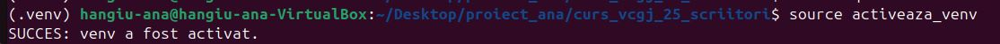
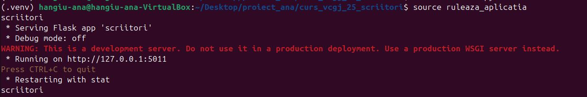

#Exemplu pagina principala
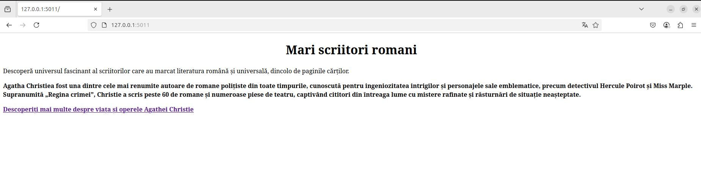

#Pagina Agatha Christie


#Pagina Opera Reprezentativa
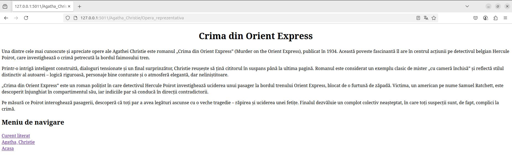

#Pagina Curent Literar
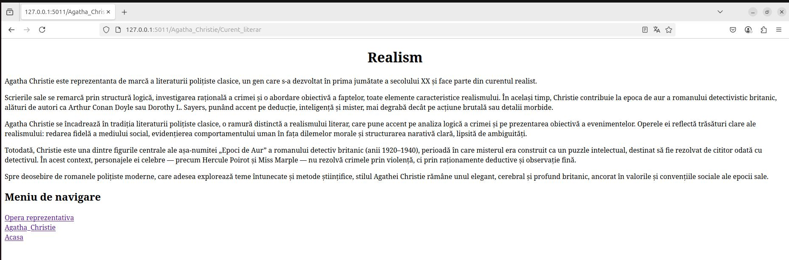


# Testare cu pytest
[cuprins](#cuprins)
O parte dintre funcțiile din biblioteca aplicației, aflate în fișierul feature.py din directorul libs, au asociate teste unitare. Aceste teste verifică funcționarea corectă a funcțiilor prin apelarea lor cu valori de intrare cunoscute și compararea rezultatului obținut cu cel așteptat. Dacă rezultatul coincide cu valoarea așteptată, testul este marcat ca PASS; în caz contrar, este considerat FAIL.

Pentru testare s-a folosit pachetul **pytest** din python. Acesta se afla in lista de pachete care trebuie instalate, in fisierul requirements.txt.
Executia testelor se face cu oricare din comenzile de mai jos, apelate din directorul aplicatiei - *scriitori*:
```
   pytest
   python -m pytest
   flask --app scriitori test
   
(.venv) hangiu-ana@hangiu-ana-VirtualBox:~/Desktop/proiect_ana/curs_vcgj_25_scriitori$ pytest
============================================================================ test session starts ============================================================================
platform linux -- Python 3.12.3, pytest-7.4.4, pluggy-1.4.0
rootdir: /home/hangiu-ana/Desktop/proiect_ana/curs_vcgj_25_scriitori
configfile: pytest.ini
collected 2 items                                                                                                                                                           

app/test/test_lib.py::test_opera_reprezentativa PASSED                                                                                                                [ 50%]
app/test/test_lib.py::test_curent_literar PASSED                                                                                                                      [100%]

============================================================================= 2 passed in 0.05s =============================================================================
```


# Verificare statica cu pylint
[cuprins](#cuprins)

- **pylint** - pachet python folosit la testarea calitatii codului (spatii, nume variabile, variabile neutilizate etc.)
- in cazul de fata, problemele returnate de pylint doar sunt afisate, nu sunt considerate erori
```
pylint scriitory.py

(.venv) hangiu-ana@hangiu-ana-VirtualBox:~/Desktop/proiect_ana/curs_vcgj_25_scriitori$ pylint scriitori.py
************* Module scriitori
scriitori.py:13:0: C0301: Line too long (143/100) (line-too-long)
scriitori.py:14:0: C0301: Line too long (441/100) (line-too-long)
scriitori.py:15:0: C0301: Line too long (110/100) (line-too-long)
scriitori.py:22:0: C0301: Line too long (327/100) (line-too-long)
scriitori.py:23:0: C0301: Line too long (319/100) (line-too-long)
scriitori.py:24:0: C0301: Line too long (555/100) (line-too-long)
scriitori.py:34:0: C0301: Line too long (335/100) (line-too-long)
scriitori.py:35:0: C0301: Line too long (380/100) (line-too-long)
scriitori.py:36:0: C0301: Line too long (359/100) (line-too-long)
scriitori.py:37:0: C0301: Line too long (271/100) (line-too-long)
scriitori.py:47:0: C0301: Line too long (192/100) (line-too-long)
scriitori.py:48:0: C0301: Line too long (439/100) (line-too-long)
scriitori.py:49:0: C0301: Line too long (426/100) (line-too-long)
scriitori.py:50:0: C0301: Line too long (442/100) (line-too-long)
scriitori.py:51:0: C0301: Line too long (262/100) (line-too-long)
scriitori.py:1:0: C0114: Missing module docstring (missing-module-docstring)
scriitori.py:11:0: C0116: Missing function or method docstring (missing-function-docstring)
scriitori.py:19:0: C0116: Missing function or method docstring (missing-function-docstring)
scriitori.py:32:0: C0116: Missing function or method docstring (missing-function-docstring)
scriitori.py:45:0: C0116: Missing function or method docstring (missing-function-docstring)
scriitori.py:63:4: C0415: Import outside toplevel (pytest) (import-outside-toplevel)

-----------------------------------
Your code has been rated at 5.62/10

```


# Docker
[cuprins](#cuprins)

##Creare container

Dupa crearea Dockerfile, in acelasi director cu acest fisier - pentru acest caz
scriitori, trebuie executata comanda:
 sudo docker build -t scriitori:v01 .

Aceasta creeaza o imagine de container care poate fi vizualizata cu comanda:
 
    sudo docker images

    ex:
    REPOSITORY                  TAG             IMAGE ID       CREATED       SIZE
    scriitori                     v01           61ce2221d887   1 hour ago    79.7MB
    python                      3.8-alpine      cd39247b02f9   8 months ago    47.4MB

    Sunt utilizate doua imagini Docker:
    - Imaginea de bază: python:3.8-alpine, care servește drept fundament pentru construirea imaginii aplicației.
    - Imaginea aplicației: scriitori:v01, construită pe baza imaginii Python, în care se creează un mediu virtual (venv),
       se instalează pachetele necesare și se copiază fișierele aplicației.
[cuprins](#cuprins)      codul aplicatiei - conform Dockerfile
##Executie container

Pentru a genera un container din fisierul imagine trebuie executata comanda run:

    sudo docker run --name scriitori -p 8020:5011 scriitori:v01 

    Aceasta va crea containerul si va si porni executia acestuia.

    Portul pe calculator unde va raspunde serverul din docker este  - 8020
    Portul in interiorul containerului este                         - 5011.

    Rezultatul executie containerului va fi vizibil in terminalul de unde s-a dat
    comanda.
    In consola apar mesajele generate de aplicatia din container.

    -d - optiune care trebuie adaugata pentru a rula containerul in background
         altfel, consola din care ruleaza containerul este blocata pe timpul
         rularii acestuia
 
    NOTA:
    --nume <nume>  este de folosit aceasta optiune.
                   altfel docker va crea un string aleator si-l va aloca ca nume
                   container-ului pornit

##Vizualizare containere

    - vizualizare continere care ruleaza


    sudo docker ps

    CONTAINER ID   IMAGE                            COMMAND              CREATED          STATUS          PORTS                                       NAMES
    13852c8ac28f   scriitori:v01                    "./dockerstart.sh"   3 hours ago      Up 22 minutes   0.0.0.0:8020->5011/tcp, :::8020->5011/tcp   scriitori

    - vizualizarea tuturor containerelor (inclusiv cele oprite)


    sudo docker ps -a

    CONTAINER ID   IMAGE                            COMMAND              CREATED          STATUS                     PORTS                                       NAMES
    13852c8ac28f  scriitori:v01                      "./dockerstart.sh"   3 hours ago      Exited (0) 10 seconds ago                                            scriitori


##Oprire / pornire container - cu aplicatia din container

    sudo docker stop scriitori
    sudo docker start scriitori

##Curatenie - stergere containere / imagini


    sudo docker rm  <container (id, nume)r>
    sudo docker rmi <imagine (id, nume:tag ...)>

##Lista de comenzi docker utile:

        Creare container:            sudo docker build -t <nume>:<tag>
        Vizualizare imagini:         sudo docker images
        Vizualizare containere:      sudo docker ps / sudo docker ps -a
        Rulare container:            sudo docker run -name <nume> -p <port PC>:<port Container> <imagine> [-d] # -d pentru a rula in background
        Stop container:              sudo docker stop
        Start container:             sudo docker start
        Executie shell:              sudo docker exec -it <nume> sh
        Atasare la container:        sudo docker atach <nume>


# DevOps CI
[cuprins](#cuprins)
- CI = Continuous Integration

## Exemplu executie pipeline Jenkins
Pentru ca ultimul pas din pipeline-ul Jenkins — crearea containerului Docker — să poată fi executat corect în acest branch, este necesar ca utilizatorul sub care rulează Jenkins să aibă permisiunea de a executa comenzi Docker.

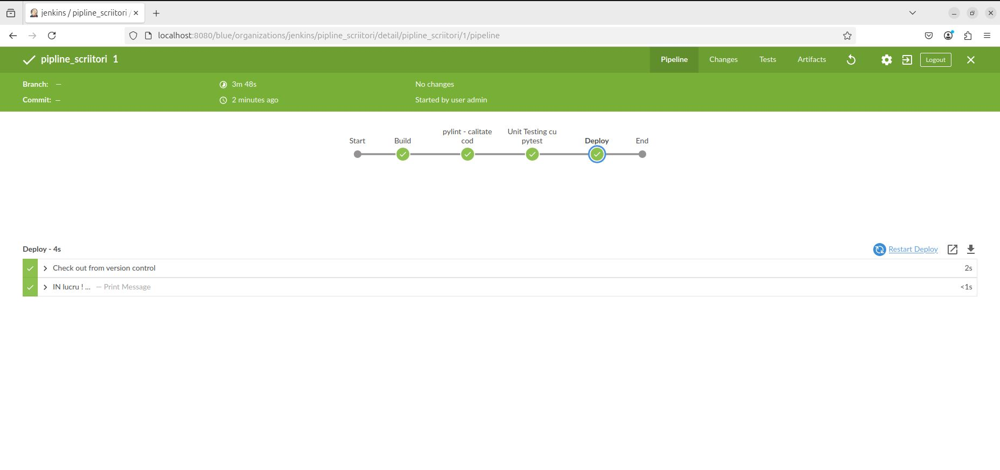
# Bibliografie:
[cuprins](#cuprins)
- [Github Sysinfo](https://github.com/crchende/sysinfo/tree/simplu_main)

# IONESCU MIHAI
[cuprins](#cuprins)

# MARE VLAD
[cuprins](#cuprins)

# MARIN CRISTIAN
[cuprins](#cuprins)

# MARINESCU ANDREI
[cuprins](#cuprins)

# MATEI ANDRA
[cuprins](#cuprins)

# MAZILESCU MIHAI
[cuprins](#cuprins)

# MIHAILA ADELIN
[cuprins](#cuprins)

# curs_vcgj_25_scriitori

`Scriitori`
=====================================

# Cuprins

1. [Descriere aplicatie](#descriere-aplicatie)
2. [Descriere versiune](#descriere-versiune)
3. [Configurare](#configurare)
4. [Exemple pagina web](#exemple-pagina-web)
5. [Testare cu pytest](#testare-cu-pytest)
6. [Verificare statica. pylint - calitate cod](#verificare-statica-cu-pylint)
7. [Containerizare cu Docker](#containerizare-docker)
8. [Pipeline Jenkins](#exemplu-executie-pipeline-jenkins)
9. [Bibliografie](#bibliografie)

# Descriere aplicatie
[cuprins](#cuprins)

Aplicatia scriitori prezinta informatii despre cititorul ales de studentul Mihaila Adelin-Gabriel, Tahereh Mafi.
Poate fi executata doar pe Linux. A fost testata pe Ubuntu 24.04.02.
Componenta WEB a aplicatiei se bazeaza pe framework-ul `Flask`.
Aplicatia este simpla, afiseaza informatii despre autor - disponibile la butonul "Tahereh Mafi" si despre doua atribute ale scriitorului ales: cea mai buna opera a sa - disponibile la butonul "Tahereh Mafi Magnum Opus" si genul literar - disponibile la butonul "Genul literar abordat de Tahereh Mafi".

Pentru o navigare mai usoara in browser, pagina principala contine link-uri catre celelalte pagini.
Fiecare pagina specifica (cea care afiseaza informatii despre scriitor sau atributele sale) contine un link catre pagina principala.

Aplicatia contine suport pentru containerizare in fisierul `Dockerfile` din directorul principal al aplicatiei.

Din punct de vedere al testarii, este inclus unit testing cu pytest, pentru functiile din biblioteca aplicatiei, aflate in directorul `app/libs`.

Pipeline-ul pentru Jenkins este definit in fisierul `Jenkinsfile`. Acesta cloneaza codul, creeaza mediul de lucru virtual (venv), il activeaza si ruleaza testele (unit test - cu pytest, verificari statice cu pylint)

# Descriere versiune
[cuprins](#cuprins)

##v01 - afisare 'raw' fara formatare. Adaugare link-uri intre pagini.

*ruta standard '/' - URL: http://127.0.0.1:5011
*rute in aplicatia WEB pentru:
  *scriitor: '/scriitor' - URL: http://127.0.0.1:5011/scriitor',
  *cea mai buna opera: '/scriitor/opera' - URL: http://127.0.0.1:5011/scriitor/opera'
  *genul literar: '/scriitor/gen' - URL: http://127.0.0.1:5011/scriitor/gen'

# Configurare
[cuprins](#cuprins)

Configurare .venv si instalare pachete

In directorul 'app' rulati comenzile:

1) activeaza_venv: Incearca sa activeze venv-ul. Daca nu poate, configureaza venv-ul in directorul .venv si apoi instaleaza flask si flask-bootstrap. La urmatoarea rulare, va activa doar venv-ul.

2) ruleaza_aplicatia: De rulat dupa activarea venv-ului. Va porni serverul pe IP: 127.0.0.1 si port 5011. Acces server din browser: http://127.0.0.1:5011

#EXEMPLU activare venv si rulare
```text
adelingabriel@Ubuntu24:~/SCC/curs_vcgj_25_scriitori$ source activeaza_venv
SUCCESS: venv was activated.
(.venv) adelingabriel@Ubuntu24:~/SCC/curs_vcgj_25_scriitori$ source ruleaza_aplicatia
Scriitori
 * Serving Flask app 'scriitori'
 * Debug mode: off
WARNING: This is a development server. Do not use it in a production deployment. Use a production WSGI server instead.
 * Running on http://127.0.0.1:5011
Press CTRL+C to quit
 * Restarting with stat
Scriitori
```

# EXEMPLE pagina web
## Pagina principala


## Pagina scriitorului


Functiile din biblioteca de functii a aplicatiei:
- directorul libs, fisierele:
  - biblioteca_scriitori_opera.py
  - biblioteca_scriitori_gen.py
au teste de tip 'unit - test' asociate - adica - este apelata functia si se asteapta o anumita valoare.
Testul compara valoarea obtinuta la apelul functiei cu valoarea asteptata si returneaza PASS daca valoarea primita de la functie este cea asteptata si FAIL in caz contrar.

Pentru testare s-a folosit pachetul **pytest** din python. Acesta se afla in lista de pachete care trebuie instalate, in fisierul quickrequirements.txt. Executia testelor se face cu oricare din comenzile de mai jos, apelate din directorul aplicatiei *scriitor*:
```
   pytest
   python -m pytest
   flask --app scriitori test

   Ultima commanda este posibila datorita implementarii comenzii cli test in aplicatia scriitori.
   Aceasta comanda CLI, apeleaza pytest din program/script:
       pytest.main(["."])
   
   Ultima varianta, desi echivalenta cu primele doua, este mai eleganta.
   Primele doua apeleaza pytest ca fiind ceva extern aplicatiei. 
   Aici insa avem optiunea de a se 'autotesta' inclusa in aplicatie.
```

# Verificare statica cu pylint
[cuprins](#cuprins)

- **pylint** - pachet python folosit la testarea calitatii codului (spatii, nume, variabile, variabile neutilizate, etc.)
- in cazul de fata, problemele returnate de pylint doar sunt afisate, nu sunt considerate erori

# Containerizare cu Docker
[cuprins](#cuprins)

Cu ajutorul Dockerfile, in acelasi director, pentru a crea imaginea de container trebuie rulata comanda:
  sudo docker build -t scriitori:v01 .
Pentru crearea container-ului si executia sa se ruleaza executa comanda:
  sudo docker run --name scriitori -p 8020:5011 scriitori:v01
  
Pentru vizualizarea tuturor imaginilor existente: 
  sudo docker images

  Exemplu:
```
sudo docker images
[sudo] password for adelingabriel: 
REPOSITORY   TAG           IMAGE ID       CREATED             SIZE
scriitori    v4            50105b320e46   About an hour ago   86.1MB
scriitori    v01           ff5c72a24b7e   4 hours ago         86.1MB
sysinfo      v1            414e82ea2f69   3 weeks ago         276MB
sysinfo      v01           95ea03f27092   7 weeks ago         275MB
sysinfo      v02           95ea03f27092   7 weeks ago         275MB
python       3.10-alpine   2a80925da4ce   5 months ago        51.1MB
```
Imaginea python este cea care sta la baza crearii imaginii folosite pentru containerizarea aplicatiei - scriitori:v4.
Imaginea scriitori creeaza venv-ul, instaleaza pachetele necesare, copiaza codul aplicatiei conform Dockerfile.

Pentru vizualizarea tuturor containerelor, atat pornite, cat si oprite:
  sudo docker ps -a

  Exemplu:
```
sudo docker ps -a
CONTAINER ID   IMAGE           COMMAND              CREATED             STATUS                     PORTS                                       NAMES
a89f2b15b51d   scriitori:v4    "./dockerstart.sh"   About an hour ago   Created                                                                scriitori4
822e93584dff   scriitori:v01   "./dockerstart.sh"   4 hours ago         Exited (0) 4 hours ago                                                 scriitori
2c0a63542a6c   sysinfo:v1      "./dockerstart.sh"   3 weeks ago         Exited (0) 3 weeks ago                                                 sysinfo1
fad78b32f79f   sysinfo:v02     "./dockerstart.sh"   7 weeks ago         Exited (255) 5 weeks ago   0.0.0.0:8020->5011/tcp, :::8020->5011/tcp   sysinfo2
b2ba8a4287fd   sysinfo:v01     "./dockerstart.sh"   7 weeks ago         Exited (0) 7 weeks ago                                                 sysinfo
```
Portul pe calculator unde va raspunde serverul din docker este 8020.
Portul in interiorul containerului este 5011.

Rezultatul executiei containerului va fi vizibil in terminalul de unde s-a dat
comanda.
In consola apar mesajele generate de aplicatia din container.

-d - optiune care trebuie adaugata pentru a rula containerul in background
     altfel, consola din care ruleaza containerul este blocata pe timpul
     rularii acestuia
     
NOTA:
--nume <nume>  este de folosit aceasta optiune.
               altfel docker va crea un string aleator si-l va aloca ca nume
               container-ului pornit

Pentru pornirea/oprirea unui container existent:
  sudo docker stop site
  sudo docker start site
  
In cazul in care containerul nu porneste poate fi folosita comanda de mai jos pentru a crea un container cu imaginea cu probleme care in loc entrypoint-ul configurat va folosi shell ca entrypoint.

  sudo docker run -it --rm --entrypoint sh <image:tag>

Pentru stergerea containerelor/imaginilor:
  sudo docker rm  <container (id, nume)r>
  sudo docker rmi <imagine (id, nume:tag ...)>

# Exemplu executie pipeline Jenkins
[cuprins](#cuprins)

Pentru a se putea executa si ultimul pas din pipeline-ul de Jenkins din acest branch - creare container docker, trebuie ca userul care ruleaza Jenkins sa poata da comenzi de docker, fara sudo + parola.


# Bibliografie:
[cuprins](#cuprins)
[Github Sysinfo](https://github.com/crchende/sysinfo/blob/simplu_main)

# PATRASCU GEORGE
[cuprins](#cuprins)

# PAUN FLORIN
[cuprins](#cuprins)

# curs_vcgj_25_scriitori

`Scriitori`
=====================================

# Cuprins

1. [Descriere aplicatie](#descriere-aplicatie)  
2. [Descriere versiune](#descriere-versiune)  
3. [Configurare](#configurare)  
4. [Testare cu pytest](#testare-cu-pytest)  


# Descriere aplicatie
[cuprins](#cuprins)

Aplicatia `scriitori` prezinta informatii despre scriitorul ales de studentul Mihaila Adelin-Gabriel, **Dmitry Glukhovsky**.  
Poate fi executata doar pe Linux. A fost testata pe Ubuntu 22.04.02.  
Componenta WEB a aplicatiei se bazeaza pe framework-ul `Flask`.  
Aplicatia este simpla, afiseaza informatii despre autor - disponibile la butonul "Dmitry Glukhovsky".

Pentru o navigare mai usoara in browser, pagina principala contine link-uri catre celelalte pagini.  
Fiecare pagina specifica (cea care afiseaza informatii despre scriitor sau atributele sale) contine un link catre pagina principala.

Aplicatia contine suport pentru containerizare in fisierul `Dockerfile` din directorul principal al aplicatiei.

Din punct de vedere al testarii, este inclus unit testing cu pytest, pentru functiile din biblioteca aplicatiei, aflate in directorul `app/libs`.

Pipeline-ul pentru Jenkins este definit in fisierul `Jenkinsfile`. Acesta cloneaza codul, creeaza mediul de lucru virtual (venv), il activeaza si ruleaza testele (unit test - cu pytest, verificari statice cu pylint).

# Descriere versiune
[cuprins](#cuprins)

## v01 - afisare 'raw' fara formatare. Adaugare link-uri intre pagini.

- ruta standard `'/'` - URL: http://127.0.0.1:5011  
- rute in aplicatia WEB pentru:  
  - scriitor: `/scriitor` - URL: http://127.0.0.1:5011/scriitor  
  - cea mai buna opera: `/scriitor/opera` - URL: http://127.0.0.1:5011/scriitor/opera  
  - genul literar: `/scriitor/gen` - URL: http://127.0.0.1:5011/scriitor/gen  

# Configurare
[cuprins](#cuprins)

Configurare `.venv` si instalare pachete

In directorul `app` rulati comenzile:

1. `activeaza_venv`: Incearca sa activeze venv-ul. Daca nu poate, configureaza venv-ul in directorul `.venv` si apoi instaleaza `flask` si `flask-bootstrap`. La urmatoarea rulare, va activa doar venv-ul.  
2. `ruleaza_aplicatia`: De rulat dupa activarea venv-ului. Va porni serverul pe IP: 127.0.0.1 si port 5011. Acces server din browser: http://127.0.0.1:5011

## EXEMPLU activare venv si rulare

```text
guest@Ubuntu24:~/SCC/curs_vcgj_25_scriitori$ source activeaza_venv
SUCCESS: venv was activated.
(.venv) guest@Ubuntu24:~/SCC/curs_vcgj_25_scriitori$ source ruleaza_aplicatia
Scriitori
 * Serving Flask app 'scriitori'
 * Debug mode: off
WARNING: This is a development server. Do not use it in a production deployment. Use a production WSGI server instead.
 * Running on http://127.0.0.1:5011
Press CTRL+C to quit
 * Restarting with stat
Scriitori
```


Functiile din biblioteca de functii a aplicatiei:
- directorul `libs`, fisierul:
  - `biblioteca_scriitori.py`
    
au teste de tip *unit test* asociate. Acestea compara rezultatul obtinut de la functii cu valoarea asteptata, returnand **PASS** daca sunt egale si **FAIL** in caz contrar.

Pentru testare s-a folosit pachetul `pytest`. Se afla in `quickrequirements.txt`. Executia testelor:

```bash
pytest
python -m pytest
flask --app scriitori test
```

Ultima comanda functioneaza datorita definirii unei comenzi CLI `test` in aplicatie, care apeleaza `pytest.main(["."])`.

# POPA ADRIAN
[cuprins](#cuprins)

# curs_vcgj_25_scriitori
[cuprins](#cuprins)

## 📑 Cuprins

1. [ Descriere generală](#-descriere-generală)  
2. [ Structura proiectului](#-structura-proiectului)  
3. [ Funcționalități](#-funcționalități)  
4. [ Comenzi utile](#-comenzi-utile)  
5. [ Teste cu unittest](#-teste-unitare)  
6. [ Automatizare Jenkins](#️-automatizare-jenkins)  
7. [ Bibliografie](#-Bibliografie)

---

## Descriere generală

Aplicația Scriitori – John Steinbeck este un proiect dezvoltat în Python, care oferă o prezentare a vieții și operelor scriitorului american John Steinbeck. Aceasta rulează ca o aplicație web minimalistă, construită cu framework-ul Flask, și permite accesarea rapidă a informațiilor printr-o interfață simplă, organizată pe mai multe rute.

Fișierul principal al aplicației gestionează trei rute: pagina principală (/), descrierea autorului (/descriere), o listă cu operele importante (/carti) si curentul literar.

Conținutul afișat este generat din funcții separate, organizate în module proprii, stocate în directorul app/lib/.

Proiectul include și o componentă de testare automată. Folosind framework-ul unittest, au fost scrise teste pentru funcțiile principale ale aplicației, care verifică integritatea datelor afișate și corectitudinea tipurilor returnate.

Pentru analiză statică a codului, aplicația este integrată cu pylint, iar toate verificările sunt automatizate într-un pipeline Jenkins. Acest pipeline rulează toate etapele importante:

1. clonarea codului

2. crearea și activarea unui mediu virtual (venv)

3. instalarea dependențelor din quickrequirements.txt

4. rularea testelor și verificărilor

5. construirea imaginii Docker

Aplicația este containerizată complet prin intermediul unui fișier Dockerfile, care permite rularea într-un mediu izolat, fără configurări manuale. Astfel, proiectul este pregătit pentru livrare și testare în medii controlate, fiind un exemplu complet de integrare a conceptelor de dezvoltare modernă: cod Python, web cu Flask, testare, CI și Docker.

---

## Structura proiectului

```
├── app/
│   ├── popa_adrian_scriitori.py (fișier principal Flask)
│   └── lib/
│       ├── descriere.py 
│       └── carti.py 
	└── curent_literar.py 
├── test/
│   └── testare.py 
├── Dockerfile
├── quickrequirements.txt
├── Jenkinsfile
├── .gitignore
└── README.md
```

---

## Funcționalități

- **Rute**
 * ruta standard '/' - URL: http://127.0.0.1:5000
 * rute în aplicația web pentru:
   * autor: `/John_Steinbeck`
   * descriere: `/John_Steinbeck/descriere`
   * cărți: `/John_Steinbeck/carti`
   * curent literar: `/John_Steinbeck/curent_literar`

- **Testare cu unittest**
  - Se folosește `unittest` pentru a testa funcțiile principale (`get_descriere`, `get_carti`, `get_curent_literar`) aflate în `app/lib`.
```bash
PYTHONPATH=app python3 -m unittest discover -s test
```

- **Verificare automată a codului**
  - `pylint` rulează automat în Jenkins și verifică calitatea codului
```bash
pylint app/lib/*.py
``

- **Docker**
Aplicația este containerizată printr-un `Dockerfile`. Imaginea se poate construi și rula astfel:

```bash
docker build -t popa_adrian_scriitori_app .
docker run -p 5000:5000 popa_adrian_scriitori_app
```
# DevOps CI

Se folosește Jenkins pentru automatizarea testării și build-ului aplicației.

---

## Comenzi utile

### Creare de fisiere si clonare repo:
```bash
mkdir proiect_scc
cd proiect_scc
git clone https://github.com/daeryn19/curs_vcgj_25_scriitori.git
cd curs_vcgj_25_scriitori

### Activare mediu virtual:
```bash
python3 -m venv venv
source venv/bin/activate
```

### Instalare dependențe:
```bash
pip install -r quickrequirements.txt
```

### Rulare aplicație:
```bash
python3 popa_adrian_scriitori.py
```

### Build Docker:
```bash
docker build -t popa_adrian_scriitori_app .
docker run -p 5000:5000 popa_adrian_scriitori_app
```

---

## Testare

Fișierul `test/testare.py` conține două clase de test care validează funcțiile `get_descriere()`, `get_carti()` si get_curent_literar. Testele verifică:
- dacă tipul returnat este string
- dacă textul conține numele autorului
- dacă textul conține curentul literar al autorului 

---

## Automatizare Jenkins

Pipeline-ul este definit în fișierul `Jenkinsfile` și conține următoarele etape:

- clonare repo
- creare și activare mediu virtual
- instalare dependințe
- rulare pylint
- rulare teste
- build Docker

## Exemplu execuție pipeline Jenkins


---

# Bibliografie

- [Documentație Flask](https://flask.palletsprojects.com/)
- [GitHub Docs](https://docs.github.com/)
- [Jenkins Docs](https://www.jenkins.io/doc/)
- [Docker Docs](https://docs.docker.com/)

# POPESCU VLAD
[cuprins](#cuprins)

# RISTOIU FLORIN
[cuprins](#cuprins)

# curs_vcgj_25_scriitori
# 📚 Proiect: Ion Creangă – Prezentare interactivă

Acest proiect este o aplicație web ușoară, dezvoltată cu Flask și containerizată folosind Docker, care oferă o prezentare interactivă a vieții și operei lui Ion Creangă. Include pagini tematice și este integrat într-un proces de livrare continuă (CI/CD) cu Jenkins.
---

## 🔧 Tehnologii folosite

- Python 3.12
- Flask
- Gunicorn
- Docker
- Jenkins (CI/CD)
- Pytest & Pylint (testare și verificare stil)

---

## 📂 Structura proiectului
```
.
├── ion_creanga.py           # Cod principal Flask
├── requirements.txt         # Biblioteci necesare
├── Dockerfile               # Configurare Docker
├── Jenkinsfile              # Pipeline CI pentru Jenkins
├── app/
│   ├── lib/
│   │   └── helper.py        # Funcții separate pentru conținut
│   └── tests/
│       └── test_ion_creanga.py  # Teste unitare
└── README.md                # Documentație proiect
```

# ROTARU MARA
[cuprins](#cuprins)

# curs_vcgj_25_scriitori

`scriitori`
===================================

# Cuprins

1. [Descriere aplicatie](#descriere-aplicatie)
1. [Descriere versiune](#descriere-versiune)
1. [Configurare](#configurare)
1. [Exemple pagina web](#exemple-pagina-web)
1. [Testare cu pytest](#testare-cu-pytest)
1. [Verificare statica. pylint - calitate cod](#verificare-statica-cu-pylint)
1. [Utilizare Docker si containerizare alicatie](https://github.com/crchende/sysinfo/blob/main/doc/dockerdoc.md)
1. [DevOps](#devops-ci)
   1. [Pipeline Jenkins](#exemplu-executie-pipeline-jenkins)
1. [Bibliografie](#bibliografie)

# Descriere aplicatie

Aplicația scriitori este o aplicație web educațională care oferă informații despre viața și opera scriitorului Ion Luca Caragiale. Scopul aplicației este de a facilita accesul la date esențiale despre autor și creațiile sale literare într-un mod structurat și accesibil din browser. Partea web a aplicației este construită folosind framework-ul Flask. Codul aplicației este scris în Python și folosește structuri simple pentru a încărca și afișa conținutul informativ, organizat în pagini tematice (operă reprezentativa, curente literare etc.).

Navigarea este intuitivă: pagina principală include link-uri către celelalte secțiuni ale aplicației, iar fiecare pagină tematică include un link de întoarcere la pagina principala.

Aplicatia include suport pentru containerizare in fisierul `Dockerfile` din directorul principal al aplicatiei.

Din punct de vedere al testarii, este inculs unit testing cu pytest, pentru o parte din functiile din biblioteca aplicatiei, aflate in directorul `app/libs`.

`DevOps CI`.
Pipeline-ul pentru Jenkins este definint in fisierul `Jenkinsfile`.

Pipeline-uri cloneaza codul, creaza mediul de lucru virtual (venv-ul), il activeaza si ruleaza testele (unit test - cu pytest, verificari statice cu pylint).

# Descriere versiune
## v0.1 – afisare informatii de baza despre Ion Luca Caragiale. Structura initiala a aplicatiei cu pagina principala si link-uri catre pagini tematice.

 * ruta standard '/' - URL: http://127.0.0.1:5011
 * rute in aplicatia WEB pentru:
   * scriitor: '/Ion_Luca_Caragiale' - URL: 'http://127.0.0.1:5011/Ion_Luca_Caragiale',
   * opera reprezentativa:      '/Opera_reprezentativa'      - URL: 'http://127.0.0.1:5011/Opera_reprezentativa'
   * curent literar: '/Curent_literar' - URL: 'http://127.0.0.1:5011/Curent_literar'


# Configurare
[cuprins](#cuprins)

Clonare repository

Creati spatiul de lucru si clonati aplicatia sysinfo: 

```text   
   mkdir proiect_scc
   cd proiect_scc
   git clone https://github.com/daeryn19/curs_vcgj_25_scriitori.git (aduc repository-ul scriitori de pe git in calculatorul local)

   
```

Configurare .venv

In directorul 'curs_vcgj_25_scriitori' rulati comenzile:

1) activeaza_venv: Incearca sa activeze venv-ul. 
                   Daca nu poate, configureaza venv-ul in directorul .venv si apoi instaleaza flask si flask-bootstrap.
                   La urmatoarea rulare, va activa doar venv-ul.
                
2) ruleaza_aplicatia: De rulat doar dupa activarea venv-ului. 
                      Va porni serverul pe IP: 127.0.0.1 si port: 5011.
                      Acces server din browser: http://127.0.0.1:5011

# EXEMPLU activare venv si rulare
```text
    (.venv) mara@ubuntu:~/Desktop/proiect_scc/curs_vcgj_25_scriitori$ source activeaza_venv
SUCCESS: venv was activated.
(.venv) mara@ubuntu:~/Desktop/proiect_scc/curs_vcgj_25_scriitori$ source ruleaza_aplicatia
scriitori
 * Serving Flask app 'scriitori'
 * Debug mode: off
WARNING: This is a development server. Do not use it in a production deployment. Use a production WSGI server instead.
 * Running on http://127.0.0.1:5011
Press CTRL+C to quit
 * Restarting with stat
scriitori

```


# EXEMPLE pagina web 
## Pagina principala


# Testare cu pytest
[cuprins](#cuprins)

O parte din functiile din biblioteca de functii a aplicatie:
- directorul libs, fisierele:
  - test_biblioteca.py
au teste de tip 'unit - test' asociate - adica - este apelata functia si se asteapta o anumita valoare.
Testul compara valoarea obtinuta la apelul functie cu valoarea asteptata si returneaza PASS daca valoarea primita de la functie este cea asteptata si FAIL in caz contrar.

Pentru testare s-a folosit pachetul **pytest** din python. Acesta se afla in lista de pachete care trebuie instalate, in fisierul quickrequirements.txt.

```text

(.venv) mara@ubuntu:~/Desktop/proiect_scc/curs_vcgj_25_scriitori$ pytest
================================================================================= test session starts ==================================================================================
platform linux -- Python 3.12.3, pytest-7.4.4, pluggy-1.4.0
rootdir: /home/mara/Desktop/proiect_scc/curs_vcgj_25_scriitori
configfile: pytest.ini
collected 2 items                                                                                                                                                                      

app/tests/test_biblioteca.py::test_opera_reprezentativa_Caragiale PASSED                                                                                                         [ 50%]
app/tests/test_biblioteca.py::test_curent_literar_Caragiale PASSED                                                                                                               [100%]

================================================================================== 2 passed in 0.02s ===================================================================================
```


# Verificare statica cu pylint
[cuprins](#cuprins)

- **pylint** - pachet python folosit la testarea calitatii codului (spatii, nume variabile, variabile neutilizate etc.)
- in cazul de fata, problemele returnate de pylint doar sunt afisate, nu sunt considerate erori

```text

(.venv) mara@ubuntu:~/Desktop/proiect_scc/curs_vcgj_25_scriitori$ pylint scriitori.py
************* Module scriitori
scriitori.py:17:0: C0301: Line too long (287/100) (line-too-long)
scriitori.py:18:0: C0301: Line too long (121/100) (line-too-long)
scriitori.py:25:0: C0301: Line too long (166/100) (line-too-long)
scriitori.py:34:0: C0301: Line too long (177/100) (line-too-long)
scriitori.py:44:0: C0301: Line too long (168/100) (line-too-long)
scriitori.py:1:0: C0114: Missing module docstring (missing-module-docstring)
scriitori.py:15:0: C0116: Missing function or method docstring (missing-function-docstring)
scriitori.py:23:0: C0116: Missing function or method docstring (missing-function-docstring)
scriitori.py:32:0: C0116: Missing function or method docstring (missing-function-docstring)
scriitori.py:42:0: C0116: Missing function or method docstring (missing-function-docstring)
scriitori.py:59:4: C0415: Import outside toplevel (pytest) (import-outside-toplevel)

------------------------------------------------------------------
Your code has been rated at 6.86/10 (previous run: 8.00/10, -1.14)
```

# Docker
[cuprins](#cuprins)

## Creare container

Crearea imaginii scriitori:v01 cu comanda:

sudo docker build -t scriitori:v01 .


Vizualizare imagine cu comanda:

sudo docker ps -a

```text 
    (.venv) mara@ubuntu:~/Desktop/proiect_scc/curs_vcgj_25_scriitori$ sudo docker images
[sudo] password for mara: 
REPOSITORY   TAG           IMAGE ID       CREATED        SIZE
scriitori    v01           1b9b74e75305   2 days ago     86MB
sysinfo      v01           00871cd7feea   7 weeks ago    275MB
```

## Executie container

Generare container cu comanda:

    sudo docker run --name scriitori -p 8020:5011 scriitori:v01 

## Vizualizare containere

```text
(.venv) mara@ubuntu:~/Desktop/proiect_scc/curs_vcgj_25_scriitori$ sudo docker ps -a
CONTAINER ID   IMAGE           COMMAND              CREATED       STATUS                   PORTS     NAMES
172574cc13fb   scriitori:v01   "./dockerstart.sh"   2 days ago    Exited (0) 4 hours ago             scriitori
2a50035b5ada   sysinfo:v01     "./dockerstart.sh"   7 weeks ago   Exited (0) 7 weeks ago             sysinfo
```


# DevOps CI
[cuprins](#cuprins)
- CI = Continuous Integration

## Exemplu executie pipeline Jenkins
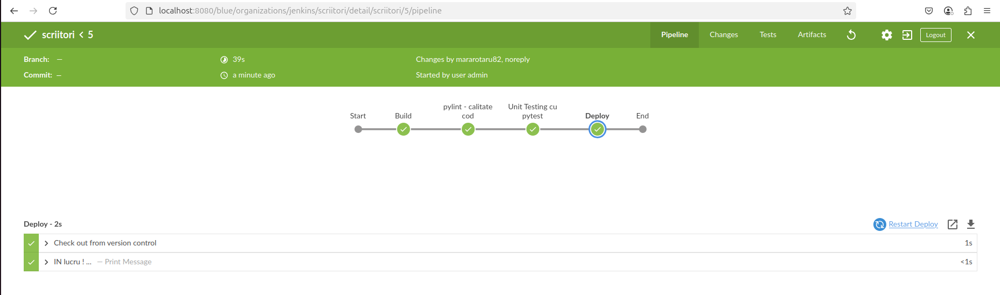


# Bibliografie:
[cuprins](#cuprins)
- [Github Actions](https://docs.github.com/en/actions)

# SMARANDACHE MIHNEA
[cuprins](#cuprins)

# VEGA TUDOR
[cuprins](#cuprins)
