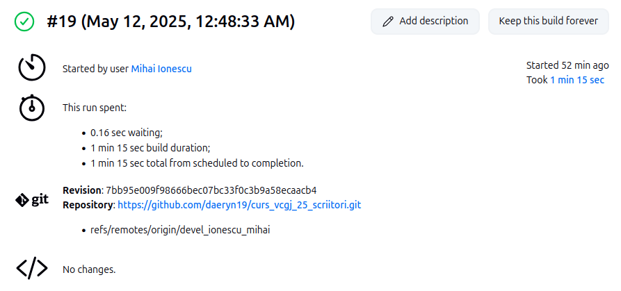

# Cuprins

1. [Descriere aplicație](#descriere-aplicație)  
2. [Descriere versiune](#descriere-versiune)  
3. [Configurare](#configurare)  
4. [Exemple pagină web](#exemple-pagină-web)  
5. [Testare cu pytest](#testare-cu-pytest)  
6. [Verificare statică cu pylint](#verificare-statică-cu-pylint)  
7. [Docker](#docker)  
   1. [Creare container](#creare-container)  
   2. [Executare container](#executare-container)  
   3. [Vizualizare containere](#vizualizare-containere)  
   4. [Oprire / pornire container](#oprire-pornire-container)  
   5. [Curățenie - ștergere containere / imagini](#curățenie-ștergere-containere-imagini)  
   6. [Comenzi utile Docker](#comenzi-utile-docker)  
8. [DevOps CI](#devops-ci)  
   1. [Exemplu execuție Jenkins](#exemplu-execuție-jenkins)  
9. [Bibliografie](#bibliografie)

---

# Descriere aplicație

Această aplicație Flask prezintă un scriitor emblematic din literatura universală: **J. R. R. Tolkien**.  
Aplicația a fost realizată în cadrul cursului *Servicii Cloud și Containerizare*, ca proiect didactic.  

Funcționalități:
- afișează informații despre viața și opera lui Tolkien;
- oferă acces la:
  - biografia sa;
  - opera reprezentativă (*Stăpânul Inelelor*);
  - curentul literar (*Fantasy*).

Pagini interconectate prin linkuri pentru navigare ușoară.

Aplicația este containerizată cu Docker și conține testare automată cu `pytest`, verificare statică cu `pylint` și pipeline DevOps cu Jenkins.

---

# Descriere versiune

## v0.1 – Versiune de bază funcțională

- Aplicația rulează pe: `http://127.0.0.1:5011`
- Rute disponibile:
  - `/` – pagina principală;
  - `/tolkien` – detalii despre scriitor;
  - `/tolkien/opera_reprezentativa` – opera sa emblematică;
  - `/tolkien/curent_literar` – stilul literar abordat.

---

# Configurare

1. `source activeaza_venv`
2. `source ruleaza_aplicatia`

---

# Exemple pagină web


---

# Testare cu pytest

Testele unitare sunt scrise pentru funcțiile din `app/libs/feature.py` și se află în `tests/test_lib.py`.

Comenzi pentru testare:
```bash

python -m pytest
flask --app scriitori test
```

---

# Verificare statică cu pylint
pylint - pachet python folosit la testarea calitatii codului (spatii, nume variabile, variabile neutilizate etc.)
```bash
pylint scriitori.py
```

---

# Docker

## Creare container

```bash
sudo docker build -t scriitori:v01 .
```

## Executare container

```bash
sudo docker run -p 5011:5011 scriitori:v1
```

## Vizualizare containere

```bash
sudo docker ps       # cele active
sudo docker ps -a    # toate
```


## Oprire / Pornire container

```bash
sudo docker stop scriitori
sudo docker start scriitori
```

## Curățenie

```bash
sudo docker rm scriitori
sudo docker rmi scriitori:v01
```

## Comenzi utile Docker

```bash
docker build -t scriitori:v01 .
docker run --name scriitori -p 8020:5011 scriitori:v01
docker ps -a
docker stop scriitori
docker exec -it scriitori sh
```

---

# DevOps CI

## Exemplu execuție Jenkins

Pipeline-ul automatizat:
- clonează codul din GitHub;
- creează și activează `venv`;
- rulează `pylint`, `pytest`;
- construiește imaginea Docker.

---

# Bibliografie

- https://ro.wikipedia.org/wiki/J._R._R._Tolkien  
- https://www.python.org/  
- https://flask.palletsprojects.com/  
- https://docs.docker.com/  
- https://docs.pytest.org/  
- https://pylint.pycqa.org/